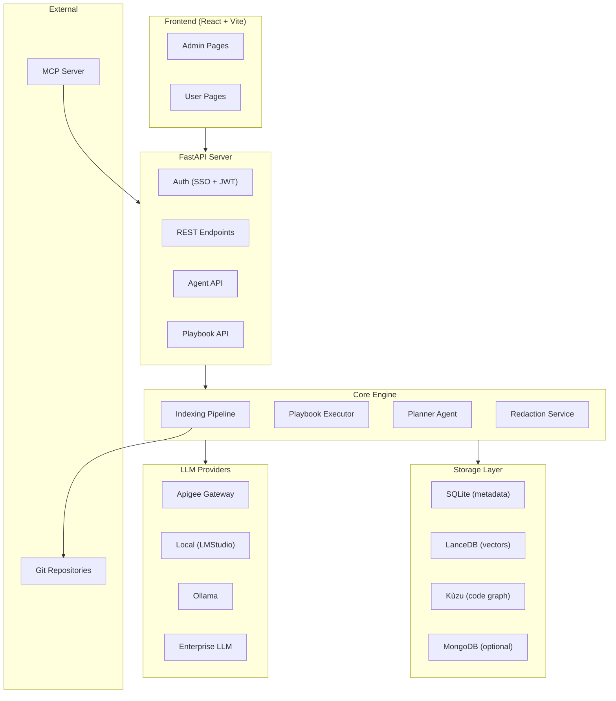
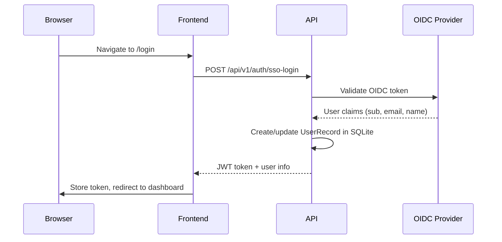
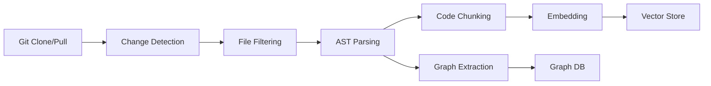
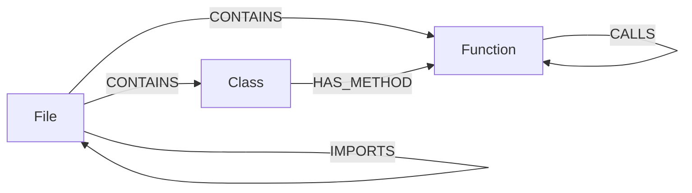
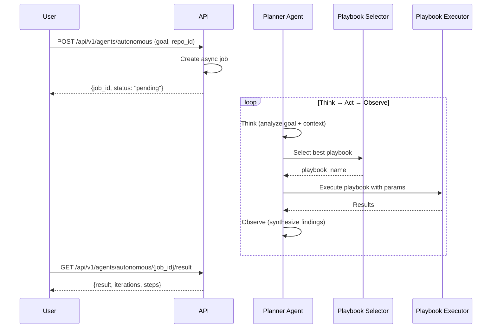

# CodeMind — Complete Platform Documentation

> AI-Powered Code Intelligence & Enterprise Discovery Platform

---

## Table of Contents

1. [Overview](#overview)
2. [Architecture](#architecture)
3. [Authentication & Authorization](#authentication--authorization)
4. [Code Indexing Pipeline](#code-indexing-pipeline)
5. [Storage Layer](#storage-layer)
6. [LLM Providers](#llm-providers)
7. [Playbook System](#playbook-system)
8. [Autonomous Agent System](#autonomous-agent-system)
9. [Privacy & Redaction](#privacy--redaction)
10. [MCP Server](#mcp-server)
11. [REST API Reference](#rest-api-reference)
12. [Frontend Application](#frontend-application)
13. [Configuration](#configuration)

---

## Overview

CodeMind is an enterprise-grade code intelligence platform that indexes, analyzes, and surfaces insights from codebases using AI. It provides:

- **Semantic Code Search** — Find code by meaning, not just keywords
- **Automated Cataloging** — AI-generated repository summaries with architecture, tech stack, and quality assessments
- **Playbook Execution** — Composable AI playbooks for code analysis, migration planning, and pattern detection
- **Autonomous Agents** — Multi-step reasoning agents that plan and execute complex code analysis tasks
- **MCP Integration** — Model Context Protocol server for IDE and AI assistant integration
- **Enterprise SSO** — OIDC-based authentication with role-based access control

---

## Architecture



### Module Map

| Module | Path | Purpose |
|--------|------|---------|
| `api/` | `src/codemind/api/` | FastAPI server, REST endpoints, auth |
| `agents/` | `src/codemind/agents/` | Planner agent, playbook selector, session store |
| `playbooks/` | `src/codemind/playbooks/` | Executor, tools, privacy, schemas, LangChain wrappers |
| `indexer/` | `src/codemind/indexer/` | AST parser, chunker, embedder, change detection |
| `graph/` | `src/codemind/graph/` | Kùzu graph DB, code graph queries |
| `storage/` | `src/codemind/storage/` | SQLite, LanceDB, MongoDB, manifest manager |
| `llm/` | `src/codemind/llm/` | LLM drivers, chat wrapper, token management |
| `mcp/` | `src/codemind/mcp/` | Model Context Protocol server |
| `batch/` | `src/codemind/batch/` | Batch processing utilities |
| `jobs/` | `src/codemind/jobs/` | Background job management |
| `worker/` | `src/codemind/worker/` | Async worker processes |
| `workflows/` | `src/codemind/workflows/` | Workflow orchestration |
| `utils/` | `src/codemind/utils/` | Shared utilities |

---

## Authentication & Authorization

### SSO Flow



### Key Details

| Feature | Implementation |
|---------|---------------|
| **Token Type** | JWT (HS256), 7-day expiry |
| **Auth Header** | `Authorization: Bearer <token>` |
| **Roles** | `admin` (full access), `user` (read + execute) |
| **Token Endpoint** | `GET /api/v1/auth/me` (verify + get user info) |
| **SSO Login** | `POST /api/v1/auth/sso-login` |

### Permission Model

| Capability | Admin | User |
|------------|-------|------|
| Index/delete repositories | ✅ | ❌ |
| View all indexed repos | ✅ | ✅ |
| Search code & catalogs | ✅ | ✅ |
| Execute playbooks | ✅ | ✅ |
| Run autonomous agents | ✅ | ✅ |
| Create/edit playbooks | ✅ | ✅ (own only) |
| Promote catalogs | ✅ | ❌ |
| Create catalog proposals | ✅ | ✅ |

---

## Code Indexing Pipeline

### Pipeline Stages



### Components

| Component | File | Function |
|-----------|------|----------|
| **Change Detector** | `indexer/change_detector.py` | Git-diff or content-hash based incremental detection |
| **Git Detector** | `indexer/git_detector.py` | Git operations: clone, pull, branch tracking |
| **File Filters** | `indexer/file_filters.py` | Smart exclusion (binaries, vendor, node_modules, etc.) |
| **AST Parser** | `indexer/ast_extractor.py` | Language-aware AST extraction for 10+ languages |
| **AST Chunker** | `indexer/ast_chunker.py` | Structure-aware code chunking (class/function boundaries) |
| **Call Extractor** | `indexer/call_extractor.py` | Function call graph extraction |
| **Import Resolver** | `indexer/import_resolver.py` | Cross-file import/dependency resolution |
| **Embedder** | `indexer/embedder.py` | Code embedding with configurable model |
| **Hash Detector** | `indexer/hash_detector.py` | Content-hash fallback for non-Git repos |

### Supported Languages

Python, JavaScript/TypeScript, Java, C#, Go, Rust, C/C++, Ruby, PHP, Kotlin, Swift, Scala, and more via tree-sitter parsers.

### Indexing API

```
POST /api/v1/index
{
  "repo_url": "https://github.com/org/repo.git",
  "branch": "main"
}
→ { "job_id": "uuid", "status": "processing" }

GET /api/v1/jobs/{job_id}
→ { "status": "completed", "progress": 100 }
```

---

## Storage Layer

### Multi-Backend Architecture

| Backend | Technology | Purpose | Data Stored |
|---------|-----------|---------|-------------|
| **Relational** | SQLite (default) / MongoDB | Metadata, users, catalogs, jobs | `RepositoryManifest`, `CatalogStore`, `UserRecord`, `PlaybookStoreModel` |
| **Vector Store** | LanceDB | Semantic search | Code embeddings, catalog embeddings |
| **Graph Database** | Kùzu | Code structure | Files, classes, functions, calls, imports |

### SQLite Schema

| Table | Key Fields |
|-------|-----------|
| `repository_manifest` | `repo_id`, `repo_name`, `repo_url`, `branch`, `status`, `chunked_files`, `total_commits`, `contributors` |
| `catalog_store` | `repo_id`, `repo_name`, `status` (draft/proposed/qualified), `description`, `architecture`, `tech_stack`, `quality_score`, `popularity_points` |
| `user_record` | `user_id`, `email`, `display_name`, `role` (admin/user), `department` |
| `playbook_store` | `id`, `name`, `description`, `yaml_content`, `author_user_id`, `is_published`, `likes` |

### LanceDB Tables

| Table | Contents |
|-------|----------|
| `code_chunks` | Embedded code chunks with `repo_id`, `file_path`, `chunk_text`, `start_line`, `end_line`, vector embedding |
| `catalog_embeddings` | Embedded catalog descriptions for semantic catalog search |

### Kùzu Graph Schema



---

## LLM Providers

Four interchangeable LLM backends, auto-detected or configured via `LLM_PROVIDER` env var:

| Provider | Env Var | Config | Use Case |
|----------|---------|--------|----------|
| **Apigee** | `LLM_PROVIDER=apigee` | `ENTERPRISE_BASE_URL`, `APIGEE_MODEL` | Enterprise API gateway (GPT-4, Claude, etc.) |
| **Local** | `LLM_PROVIDER=local` | `LOCAL_LLM_URL`, `LOCAL_LLM_MODEL` | LMStudio or any OpenAI-compatible local server |
| **Ollama** | `LLM_PROVIDER=ollama` | `OLLAMA_HOST`, `OLLAMA_MODEL` | Ollama local models |
| **Enterprise** | `LLM_PROVIDER=enterprise` | `ENTERPRISE_LLM_URL`, `ENTERPRISE_LLM_MODEL` | Custom enterprise endpoints |

### LangChain Integration

The `CmindChatModel` wraps all LLM drivers into a LangChain-compatible `BaseChatModel`, enabling:
- `bind_tools()` for tool-calling agents
- `ToolNode` for automated tool execution
- `with_structured_output()` for schema-validated responses
- Streaming support

### Token Management

- Configurable via `LLM_MAX_TOKENS`, `LLM_CONTEXT_WINDOW`
- Automatic token counting and budget allocation
- Map-reduce for large codebases (splits into batches, then merges)

---

## Playbook System

### What Are Playbooks?

Playbooks are composable AI analysis templates that define:
- **System Prompt** — Instructions for the LLM
- **Search Strategy** — How to retrieve code (semantic, hybrid, graph)
- **Output Schema** — Structured output format (Pydantic validation)
- **Tools Available** — Which tools the agent can use

### Execution Modes

| Mode | How It Works | Best For |
|------|-------------|----------|
| **Linear** | Search → LLM → Format → END | Single-pass analysis with known scope |
| **ReAct** | Agent ↔ Tools loop until done | Exploratory analysis requiring multiple searches |

### Built-In Playbooks

| Playbook | File | Mode | Purpose |
|----------|------|------|---------|
| **Analyze Codebase** | `analyze_codebase.md` | Linear | Comprehensive code analysis and architecture review |
| **Explore Codebase** | `explore_codebase.md` | ReAct | Interactive code exploration with tool-calling agent |
| **Generate Catalog** | `generate_catalog.md` | ReAct | Auto-generate repository catalog with quality assessment |
| **Search Catalogs** | `search_catalogs.md` | Linear | Semantic search across all repository catalogs |
| **Design Solution** | `design_solution.md` | Linear | Architecture and solution design from requirements |
| **Evaluate Build vs Reuse** | `evaluate_build_vs_reuse.md` | Linear | Make/buy/reuse decision analysis |
| **Migrate SSIS to ADF** | `migrate_ssis_to_adf.md` | ReAct | SSIS-to-Azure Data Factory migration planning |
| **Detect Resiliency Patterns** | `detect_resiliency_patterns.md` | ReAct | Chaos engineering readiness assessment |

### Custom Playbooks

Users can create, publish, and share custom playbooks via the Playbook Composer:

```
POST   /api/v1/playbooks           — Create custom playbook
PUT    /api/v1/playbooks/{id}      — Update playbook
DELETE /api/v1/playbooks/{id}      — Delete playbook
POST   /api/v1/playbooks/{id}/publish   — Publish to store
POST   /api/v1/playbooks/{id}/unpublish — Unpublish
POST   /api/v1/playbooks/{id}/clone     — Clone a playbook
POST   /api/v1/playbooks/{id}/like      — Like a playbook
GET    /api/v1/playbooks/store     — Browse published playbooks
```

### Agent Tools (LangChain)

9 tools available to ReAct agents:

| Tool | Description |
|------|-------------|
| `search_codebase` | Semantic/hybrid search over indexed code |
| `read_file` | Read specific file content (with line ranges) |
| `search_symbol` | Find classes/functions by name |
| `get_callers` | Find all functions that call a given function |
| `get_callees` | Find all functions called by a given function |
| `get_dependencies` | Get file import graph (imports / imported_by) |
| `list_files` | List repository files with glob filtering |
| `search_catalogs` | Search across repository catalogs |
| `save_catalog_entry` | Write catalog entries |

---

## Autonomous Agent System

### How It Works



### API Endpoints

| Endpoint | Method | Purpose |
|----------|--------|---------|
| `/api/v1/agents/autonomous` | POST | Start autonomous job |
| `/api/v1/agents/autonomous/{id}/status` | GET | Poll job status |
| `/api/v1/agents/autonomous/{id}/result` | GET | Get completed result |
| `/api/v1/agents/playbook` | POST | Execute single playbook directly |
| `/api/v1/agents/execute` | POST | Execute agent task |
| `/api/v1/agents/{id}/status` | GET | Agent task status |
| `/api/v1/agents/{id}/result` | GET | Agent task result |

### Session Management

The `SessionStore` maintains conversation history per-session, enabling multi-turn interactions through the Chat Interface.

---

## Privacy & Redaction

### Overview

The `RedactionService` automatically scrubs PII and secrets from all text before sending to external LLMs. All regex patterns are **pre-compiled at init time** for zero per-call overhead.

**Performance**: ~11ms for 41KB of text.

### Supported Patterns (40+)

| Category | Patterns |
|----------|----------|
| **PII** | Email, Phone (US + International), SSN, Credit Card, Date of Birth, IBAN, MAC Address |
| **Cloud Keys** | AWS Access Key, AWS Secret Key, Azure Storage Key, Azure Connection String, GCP Key |
| **SaaS Tokens** | GitHub PAT, GitLab Token, Slack Token, Slack Webhook, Stripe Key, Twilio Key, SendGrid Key, NPM Token, PyPI Token, Heroku Key, Mailchimp Key, Square Token |
| **Crypto Material** | Private Keys (RSA/EC/DSA/OPENSSH), Certificates |
| **Secrets** | JWT Tokens, Password Fields, Connection String Passwords, Hex Secrets |
| **Auth Headers** | Bearer Tokens, Basic Auth |
| **Generic** | API keys with 15+ prefix variants (`api_key`, `secret_key`, `client_secret`, `webhook_secret`, `master_key`, etc.) |

### Processing Order

1. **Connection string passwords** — before email/IP can false-match
2. **All compiled patterns** — in priority order (IP before Email)
3. **Generic API key patterns** — named key=value assignments
4. **Authorization headers** — Bearer and Basic auth

### LLM Error Logging

When any LLM provider returns an error, the full request context is dumped to `/tmp/llm_errors/` as a timestamped JSON file containing:
- Error type and message
- Full traceback
- Playbook name and context
- System prompt and message history (truncated to prevent disk fills)

---

## MCP Server

The Model Context Protocol server enables IDE integration (Cursor, VS Code, etc.) by exposing CodeMind capabilities as MCP tools.

### Tools

| Tool | Description |
|------|-------------|
| `catalog_search` | Semantic search across all repo catalogs |
| `code_search` | Semantic/hybrid search over indexed code |
| `catalog_browse` | Get full catalog for a specific repo |
| `agent_execute` | Start autonomous agent with a goal |
| `agent_status` | Poll agent job status |
| `agent_result` | Get completed agent result |

### Resources

| URI | Description |
|-----|-------------|
| `codemind://repos` | List all indexed repositories |
| `codemind://health` | Server health and embedding info |

### Configuration

```bash
CODEMIND_API_URL=http://localhost:8000  # API server URL
CODEMIND_TIMEOUT=120                    # Request timeout (seconds)
```

Start MCP server: `python -m codemind.mcp`

---

## REST API Reference

### Health & Debug

| Endpoint | Method | Auth | Description |
|----------|--------|------|-------------|
| `/api/v1/health` | GET | No | Server health, embedding model info |
| `/api/v1/stats` | GET | User | Platform-wide statistics |
| `/api/v1/debug/routes` | GET | No | List all registered routes |

### Authentication

| Endpoint | Method | Auth | Description |
|----------|--------|------|-------------|
| `/api/v1/auth/sso-login` | POST | No | SSO login, returns JWT |
| `/api/v1/auth/me` | GET | User | Get current user info |

### Repositories

| Endpoint | Method | Auth | Description |
|----------|--------|------|-------------|
| `/api/v1/repos` | GET | User | List all indexed repositories |
| `/api/v1/repos/{repo_id}` | GET | User | Get repository details |
| `/api/v1/repos/{repo_id}` | PUT | Admin | Update repository metadata |
| `/api/v1/repos/{repo_id}/repair` | POST | Admin | Repair repository data |
| `/api/v1/index` | POST | Admin | Index a new repository |
| `/api/v1/jobs/{job_id}` | GET | User | Get indexing job status |

### Search

| Endpoint | Method | Auth | Description |
|----------|--------|------|-------------|
| `/api/v1/search` | POST | User | Semantic/hybrid code search |
| `/api/v1/graph/query` | POST | User | Direct graph database queries |

### Git Operations

| Endpoint | Method | Auth | Description |
|----------|--------|------|-------------|
| `/api/v1/git/search` | GET | User | Search Git repositories |
| `/api/v1/git/branches` | GET | User | List branches for a repo URL |

### Catalogs

| Endpoint | Method | Auth | Description |
|----------|--------|------|-------------|
| `/api/v1/catalogs` | POST | User | Create catalog entry |
| `/api/v1/catalogs/list` | GET | User | List all catalog entries |
| `/api/v1/catalogs/search` | GET | User | Search catalogs (simple) |
| `/api/v1/catalogs/search` | POST | User | Search catalogs (advanced, with filters) |
| `/api/v1/catalogs/trending` | GET | User | Get trending catalog entries |
| `/api/v1/catalogs/proposed` | GET | User | List proposed catalogs |
| `/api/v1/catalogs/propose` | GET/POST | User | Propose new catalog entry |
| `/api/v1/catalogs/match-gaps` | POST | User | Find gaps between catalogs |
| `/api/v1/catalogs/{repo_id}` | GET | User | Get single catalog |
| `/api/v1/catalogs/{repo_id}` | DELETE | Admin | Delete catalog |
| `/api/v1/catalogs/{repo_id}/regenerate` | POST | Admin | Regenerate catalog with AI |
| `/api/v1/catalogs/{repo_id}/requirements` | PUT | User | Update requirements |
| `/api/v1/catalogs/{repo_id}/contribute` | POST | User | Contribute to catalog |
| `/api/v1/catalogs/{repo_id}/promote` | PUT | Admin | Promote catalog status |
| `/api/v1/catalogs/{repo_id}/interact` | POST | User | Record interaction (popularity tracking) |
| `/api/v1/catalogs/{repo_id}/like` | POST | User | Like a catalog entry |

### Playbooks

| Endpoint | Method | Auth | Description |
|----------|--------|------|-------------|
| `/api/v1/playbooks` | GET | User | List all playbooks |
| `/api/v1/playbooks` | POST | User | Create custom playbook |
| `/api/v1/playbooks/store` | GET | User | Browse published playbook store |
| `/api/v1/playbooks/{id}` | GET | User | Get playbook details |
| `/api/v1/playbooks/{id}` | PUT | Owner | Update playbook |
| `/api/v1/playbooks/{id}` | DELETE | Owner | Delete playbook |
| `/api/v1/playbooks/{id}/publish` | POST | Owner | Publish to store |
| `/api/v1/playbooks/{id}/unpublish` | POST | Owner | Remove from store |
| `/api/v1/playbooks/{id}/clone` | POST | User | Clone a playbook |
| `/api/v1/playbooks/{id}/like` | POST | User | Like a playbook |
| `/api/v1/playbooks/custom/all` | DELETE | Admin | Bulk delete custom playbooks |

### Agents

| Endpoint | Method | Auth | Description |
|----------|--------|------|-------------|
| `/api/v1/agents/autonomous` | POST | User | Start autonomous job |
| `/api/v1/agents/autonomous/{id}/status` | GET | User | Poll job status |
| `/api/v1/agents/autonomous/{id}/result` | GET | User | Get job result |
| `/api/v1/agents/playbook` | POST | User | Execute single playbook |
| `/api/v1/agents/execute` | POST | User | Execute agent task |
| `/api/v1/agents/{id}/status` | GET | User | Agent task status |
| `/api/v1/agents/{id}/result` | GET | User | Agent task result |

---

## Frontend Application

### Technology Stack

- **Framework**: React 18 + TypeScript
- **Build Tool**: Vite
- **Styling**: CSS (custom design system)
- **Routing**: React Router
- **State**: React hooks + context

### Admin Pages

| Page | File | Features |
|------|------|----------|
| **Dashboard** | `admin/Dashboard.tsx` | Platform overview, stats, quick actions, charts |
| **Repo List** | `admin/RepoList.tsx` | View all indexed repos with status badges |
| **Repo Index** | `admin/RepoIndex.tsx` | Index new repositories (URL + branch) |
| **Repo Edit** | `admin/RepoEdit.tsx` | Edit repo metadata, re-index, repair |
| **Catalog List** | `admin/CatalogList.tsx` | Manage catalogs, promote/demote, bulk actions |
| **Catalog Create** | `admin/CatalogCreate.tsx` | Manual catalog entry creation |
| **Playbook Composer** | `admin/PlaybookComposer.tsx` | Visual playbook YAML editor, preview, publish |
| **Proposal Create** | `admin/ProposalCreate.tsx` | Create capability proposals for gap analysis |

### User Pages

| Page | File | Features |
|------|------|----------|
| **Agent Catalog Search** | `user/AgentCatalogSearch.tsx` | AI-powered intelligent discovery with natural language search, trending items, likes, interactions |
| **Catalog Search** | `user/CatalogSearch.tsx` | Simple semantic catalog search |
| **Chat Interface** | `user/ChatInterface.tsx` | Multi-turn conversational agent with repo selection and playbook execution |
| **Playbook Store** | `user/PlaybookStore.tsx` | Browse, clone, and like community playbooks |

### Login

| Page | File | Features |
|------|------|----------|
| **Login** | `Login.tsx` | SSO login with enterprise OIDC flow |

---

## Configuration

### Environment Variables (`.env`)

#### Server
| Variable | Default | Description |
|----------|---------|-------------|
| `HOST` | `0.0.0.0` | Server bind address |
| `PORT` | `8000` | Server port |
| `CORS_ORIGINS` | `*` | Allowed CORS origins |

#### LLM
| Variable | Default | Description |
|----------|---------|-------------|
| `LLM_PROVIDER` | auto-detect | `apigee`, `local`, `ollama`, `enterprise` |
| `LLM_MAX_TOKENS` | `4096` | Max output tokens |
| `LLM_TEMPERATURE` | `0.1` | Generation temperature |
| `LLM_CONTEXT_WINDOW` | `0` (auto) | Context window size |
| `APIGEE_MODEL` | `gpt-4` | Model name for Apigee |
| `ENTERPRISE_BASE_URL` | — | Enterprise API base URL |
| `LOCAL_LLM_URL` | `http://localhost:1234/v1` | Local LLM server URL |
| `LOCAL_LLM_MODEL` | `openai/gpt-oss-20b` | Local model name |
| `OLLAMA_HOST` | `http://localhost:11434` | Ollama server URL |
| `OLLAMA_MODEL` | `llama-3.2-3b-instruct` | Ollama model name |

#### Authentication
| Variable | Default | Description |
|----------|---------|-------------|
| `JWT_SECRET_KEY` | built-in key | Secret for JWT signing |
| `SSO_CLIENT_ID` | — | OIDC client ID |
| `SSO_ISSUER_URL` | — | OIDC issuer URL |

#### Storage
| Variable | Default | Description |
|----------|---------|-------------|
| `DB_BACKEND` | `sqlite` | `sqlite` or `mongodb` |
| `DATABASE_URL` | `sqlite:///codemind.db` | SQLite database path |
| `MONGODB_URI` | — | MongoDB connection URI |
| `LANCEDB_PATH` | `./lancedb_data` | LanceDB data directory |
| `KUZU_DB_PATH` | `./kuzu_data` | Kùzu graph database path |

#### Embedding
| Variable | Default | Description |
|----------|---------|-------------|
| `EMBEDDING_MODEL` | `BAAI/bge-small-en-v1.5` | Sentence-transformer model |
| `EMBEDDING_DEVICE` | `cpu` | `cpu` or `cuda` |

#### MCP
| Variable | Default | Description |
|----------|---------|-------------|
| `CODEMIND_API_URL` | `http://localhost:8000` | API URL for MCP proxy |
| `CODEMIND_TIMEOUT` | `120` | MCP request timeout |

---

## Quick Start

```bash
# 1. Install
pip install -e .

# 2. Configure (copy .env.example → .env and edit)
cp .env.example .env

# 3. Start backend
uvicorn codemind.api.server:app --reload --port 8000

# 4. Start frontend
cd frontend && npm install && npm run dev

# 5. (Optional) Start MCP server
python -m codemind.mcp
```

### Index a Repository

```bash
curl -X POST http://localhost:8000/api/v1/index \
  -H "Authorization: Bearer <token>" \
  -H "Content-Type: application/json" \
  -d '{"repo_url": "https://github.com/org/repo.git", "branch": "main"}'
```

### Search Code

```bash
curl -X POST http://localhost:8000/api/v1/search \
  -H "Authorization: Bearer <token>" \
  -H "Content-Type: application/json" \
  -d '{"query": "authentication middleware", "repo_id": "abc123"}'
```

### Run Autonomous Agent

```bash
curl -X POST http://localhost:8000/api/v1/agents/autonomous \
  -H "Authorization: Bearer <token>" \
  -H "Content-Type: application/json" \
  -d '{"goal": "Analyze the API layer and identify all endpoints", "repo_id": "abc123"}'
```
