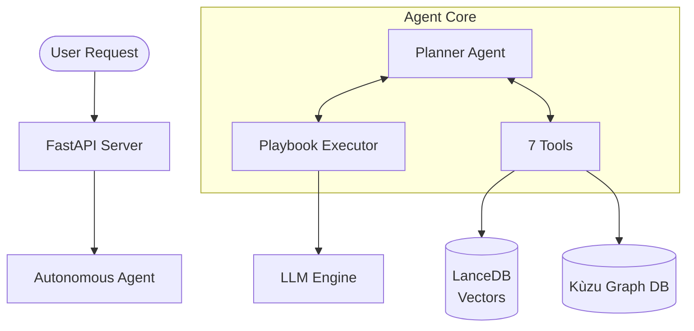

# CodeMind

**🧠 AI-Powered Code Intelligence Platform with Autonomous Agents**

CodeMind is a production-ready, **AI-powered code intelligence platform** designed to help developers, architects, and teams understand, document, and evolve complex codebases.

Unlike simple "chat with PDF" tools, CodeMind treats code as a **connected knowledge graph**, not just text. It combines **semantic vector search**, **AST-based structural analysis**, and **autonomous LangGraph agents** to provide deep, hallucination-free insights.

Whether you are onboarding a new developer, refactoring a legacy monolith, or generating up-to-date documentation, CodeMind provides the intelligence layer your team needs.

### 🌟 Why CodeMind?

*   **Beyond RegEx**: We don't just grep strings. We understand *classes*, *functions*, *calls*, and *dependencies* across 20+ languages.
*   **Agentic Reasoning**: Our autonomous agents don't just answer questions; they **plan**, **explore**, and **reason**. They can "Find all controllers using Auth v1, check their tests, and propose a migration plan."
*   **Scalable Architecture**: Built on **LanceDB** (vectors) and **Kùzu** (graph), CodeMind scales to millions of lines of code without slowing down.
*   **Privacy First**: Runs 100% locally or in your private cloud. Your code never leaves your infrastructure unless you configure it to.

---

## 🎯 Core Capabilities
- **⚡ Batch Indexing** — Process multiple repositories in parallel
- **🚀 Non-Blocking API** — Asynchronous execution for responsive interactions

**Perfect for:**
- Onboarding new developers
- Generating documentation
- Understanding legacy code
- Impact analysis and refactoring
- Cross-file dependency tracing

---

## ✨ Key Features

### 1. Intelligent Code Search

**Semantic Search** — Powered by `BAAI/bge-base-en-v1.5` (768d) with query instruction prefixing for asymmetric retrieval.

```bash
POST /api/v1/search
{
  "query": "authentication middleware",
  "repo_id": "abc123",
  "search_mode": "hybrid",
  "min_score": 0.7,  # Filter low-relevance results
  "limit": 10
}
```

**Hybrid Search** — Combines vector similarity with graph-based structural filters (file types, patterns, symbol names).

### 2. Autonomous Agents 🤖

CodeMind features a **Planner-Executor Autonomous Agent** that uses a **Think → Act → Observe** loop to solve complex problems.

**Capabilities:**
- ✅ **Multi-Step Planning** — Breaks down goals into tool/playbook steps
- ✅ **7 Specialized Tools** — Search, read files, trace callers/callees, resolve dependencies
- ✅ **Playbook Integration** — Can invoke specialized playbooks (e.g., `code_analyzer`)
- ✅ **Self-Correction** — Retries on failure and adjusts strategy
- ✅ **Auto-Finish** — Automatically detects when the goal is met

**Example Request:**
```bash
POST /api/v1/agents/autonomous
{
  "goal": "What functions call the authenticate() method and which files import auth.py?",
  "repo_id": "abc123"
}
```

### 3. Playbooks (Prompt-Based Strategies)

Playbooks are high-level strategies defined in Markdown that guide the Agent or LLM on how to solve specific tasks.

**Default Playbook: `code_analyzer`**
- **Goal**: Deeply analyze code structure and logic.
- **Features**: Hybrid search, context packing, map-reduce for large files.
- **Configurable**: Define `min_score`, `max_batches`, and system prompts in `.md` files.

### 4. Repository Catalogs 📚

Catalogs are high-level summaries and documentation generated automatically by playbooks.

- **Create**: Generate a summary for a repo (e.g., "Security Overview").
- **Search**: Search across *all* catalogs to find relevant repositories.
- **browse**: View all catalog entries for a specific repository.

```bash
POST /api/v1/catalogs
{
  "repo_id": "abc123",
  "playbook_name": "code_analyzer",
  "prompt": "Create a high-level architectural overview"
}
```

### 5. Batch Indexing ⚡

Index multiple repositories at once using the batch processor.

**Usage:**
1. Create a JSON config file (e.g., `batch_config.json`):
   ```json
   [
     { "url": "https://github.com/fastapi/fastapi", "branch": "master" },
     { "url": "https://github.com/tiangolo/typer", "branch": "master" }
   ]
   ```
2. Run the script:
   ```bash
   ./run_batch_indexer.sh batch_config.json --wait
   ```

---

## 🏗️ Architecture

### System Overview



### Technology Stack

| Layer | Technology |
|-------|-----------|
| **API** | [FastAPI](https://fastapi.tiangolo.com/) |
| **Agent** | [LangGraph](https://github.com/langchain-ai/langgraph) |
| **Vector DB** | [LanceDB](https://lancedb.com/) |
| **Graph DB** | [Kùzu](https://kuzudb.com/) |
| **AST Parsing** | [Tree-sitter](https://tree-sitter.github.io/) |
| **Embeddings** | [BAAI/bge-base-en-v1.5](https://huggingface.co/BAAI/bge-base-en-v1.5) |

---

## 🚀 Quick Start

### Prerequisites
1. **Python 3.12+**
2. **Local LLM Server** (e.g., LM Studio/Ollama) OR OpenAI API Key

### Installation

```bash
# Clone repository
git clone <your-repo-url>
cd cmind

# Create virtual environment
python -m venv .venv
source .venv/bin/activate

# Install dependencies
pip install -e ".[dev]"
```

### Configuration

Create a `.env` file:

```env
# LLM Provider
LLM_PROVIDER=local                        # local, ollama, apigee, enterprise
LOCAL_LLM_URL=http://localhost:1234/v1
LOCAL_LLM_MODEL=openai/gpt-4o             # Model name

# Token Configuration
LLM_MAX_TOKENS=100000

# Embedding Configuration
EMBEDDING_MODEL=BAAI/bge-base-en-v1.5
```

### Start the Server

```bash
uvicorn codemind.api.server:app --reload
# Server runs on http://localhost:8000
# API docs: http://localhost:8000/docs
```

### Start the Frontend

CodeMind includes a React/Vite frontend for easy interaction.

```bash
cd frontend
npm install
npm run dev

# Frontend runs on http://localhost:5173
```

### Running Tests

```bash
# Run backend tests
pytest
```

---

## 🔌 API Reference

### Core
| Method | Endpoint | Description |
|--------|----------|-------------|
| `POST` | `/api/v1/index` | Index a repository |
| `GET` | `/api/v1/repos` | List all indexed repositories |
| `GET` | `/api/v1/jobs/{id}` | Check job status |

### Search & Graph
| Method | Endpoint | Description |
|--------|----------|-------------|
| `POST` | `/api/v1/search` | Semantic/Hybrid search |
| `POST` | `/api/v1/graph/query` | Structural graph queries |

### Agents
| Method | Endpoint | Description |
|--------|----------|-------------|
| `POST` | `/api/v1/agents/autonomous` | Start autonomous agent |
| `GET` | `/api/v1/agents/autonomous/{id}/result` | Get agent result |

### Catalogs
| Method | Endpoint | Description |
|--------|----------|-------------|
| `POST` | `/api/v1/catalogs` | Create catalog entry |
| `GET` | `/api/v1/catalogs/{repo_id}` | Get repo catalogs |
| `POST` | `/api/v1/catalogs/search` | Search across catalogs |

---
**CodeMind** — *AI-Powered Autonomous Code Intelligence*
