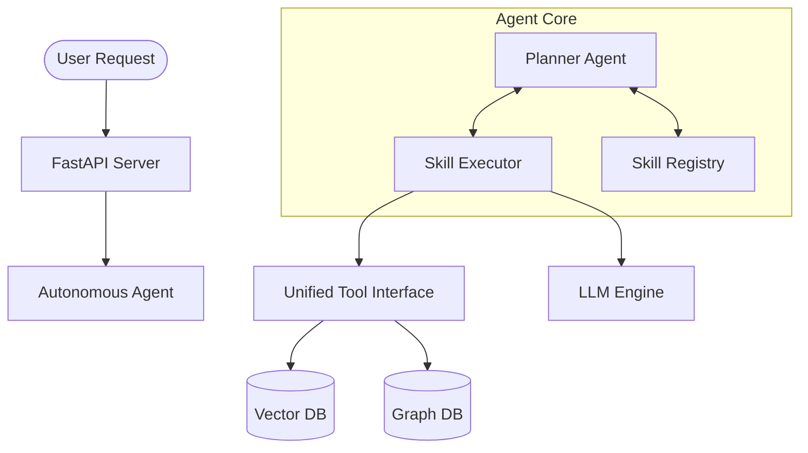

# CodeMind

**🧠 AI-Powered Code Intelligence Platform with Autonomous Agents**

CodeMind is a production-ready code analysis platform that combines semantic search, graph-based code understanding, and autonomous LangGraph agents to provide deep insights into codebases.

---

## 🎯 What is CodeMind?

CodeMind helps you understand, document, and analyze codebases using:

- **🔍 Hybrid Search** - Semantic vector search + graph-based structural queries
- **🤖 Autonomous Agents** - LangGraph agents that generate docs, answer questions, and more
- **📊 Knowledge Graphs** - Kùzu graph database for code relationships
- **💾 Append-Only Storage** - Immutable, incremental indexing with LanceDB
- **🚀 Fast API** - RESTful API for all operations

**Perfect for:**
- Onboarding new developers
- Generating documentation
- Understanding legacy code
- Code search and exploration
- Automated code analysis

---

## ✨ Key Features

### 1. Intelligent Code Search

**Semantic Search**
```bash
POST /api/v1/search
{
  "query": "authentication middleware",
  "repo_id": "abc123",
  "search_mode": "semantic",  # Vector search
  "limit": 10
}
```

**Hybrid Search** (Semantic + Graph Filters)
```bash
POST /api/v1/search
{
  "query": "database models",
  "repo_id": "abc123",
  "search_mode": "hybrid",
  "filters": {
    "file_type": ".py",
    "class_name": "BaseModel",
    "exclude_patterns": ["tests"]
  }
}
```

### 2. Autonomous Agents (New!) 🤖

CodeMind now features a **Planner-Executor Autonomous Agent** system that can solve complex goals by chaining skills.

**Capabilities:**
- ✅ **Goal Planning**: Breaks down complex requests into steps
- ✅ **Skill Selection**: Intelligently picks tools (Search, Generate, etc.)
- ✅ **Context Management**: Handles large codebases with token-aware map-reduce
- ✅ **Self-Correction**: Retries on failure and adjusts strategy

**Example Request:**
```bash
POST /api/v1/agents/autonomous
{
  "goal": "Generate comprehensive documentation for this repo",
  "repo_id": "abc123"
}
```

**How It Works:**
```
User Goal → Planner (Think) → Select Skill → Executor (Act) → Observe Result → Loop
```

### 3. Skill System (Prompt-Based)

Capabilities are defined in **Markdown** skills, not hardcoded logic. This makes the agent easily extensible.

**Current Skills:**
- **📝 Documentation Generator**: Creates READMEs, API docs, and guides
- **🔍 Code Search Assistant**: Finds and explains code snippets
- **🏗️ Architecture Mapper**: Visualizes system components (Graph-based)
- **📦 Dependency Analyzer**: Tracks imports and usage

### 4. Graph-Based Code Understanding

**Powered by Kùzu Graph Database:**
- File and directory relationships
- Code dependencies (imports, calls)
- AST-level structure (classes, functions)
- Fast structural filtering

---

## 🏗️ Architecture

### System Overview



### Technology Stack

**Core:**
- **[FastAPI](https://fastapi.tiangolo.com/)** - Modern web framework
- **[LangGraph](https://github.com/langchain-ai/langgraph)** - Agent workflow orchestration
- **[LanceDB](https://lancedb.com/)** - Vector database for semantic search
- **[Kùzu](https://kuzudb.com/)** - Embedded graph database for structure
- **[SentenceTransformers](https://www.sbert.net/)** - all-MiniLM-L6-v2 embeddings

**LLM Support:**
- **[LM Studio](https://lmstudio.ai/)** - Optimized for local LLMs (Apple Silicon/NVIDIA)
- **OpenAI Compatible** - Works with any OpenAI-like API

---

## 🚀 Quick Start

### Prerequisites
1. **Python 3.12+**
2. **Local LLM Server** (e.g., LM Studio running on `localhost:1234`)

### Installation

```bash
# Clone repository
git clone <your-repo-url>
cd cmind

# Create virtual environment
python -m venv .venv
source .venv/bin/activate

# Install dependencies
pip install -e ".[dev]"
```

### Start the Server

```bash
# Start FastAPI server
uvicorn codemind.api.server:app --reload

# Server runs on http://localhost:8000
# API docs: http://localhost:8000/docs
```

### Usage Examples

**1. Index a Repository**
```bash
curl -X POST http://localhost:8000/api/v1/index \
  -H "Content-Type: application/json" \
  -d '{"repo_path": "/path/to/local/repo"}'
```

**2. Run Autonomous Agent**
```bash
curl -X POST http://localhost:8000/api/v1/agents/autonomous \
  -H "Content-Type: application/json" \
  -d '{
    "goal": "Explain how authentication works in this codebase",
    "repo_id": "<your_repo_id>"
  }'
```

---

## 📁 Project Structure

```
cmind/
├── src/codemind/
│   ├── api/                # FastAPI routes
│   ├── agents/             # Autonomous Agent (Planner)
│   ├── skills/             # Skill Executors & Registry
│   │   ├── executors.py    # Skill execution logic
│   │   ├── tools.py        # Unified tool interface
│   │   └── schema.py       # Pydantic models
│   ├── graph/              # Kùzu graph database
│   ├── storage/            # LanceDB vector storage
│   └── workflows/          # Indexing workflows
├── skills/                 # Skill Definitions (.md files)
├── docs/                   # Documentation
└── tests/                  # Test suite
```

---

## 📝 License

[To be determined]

---

**CodeMind** - *AI-Powered Autonomous Code Intelligence*
