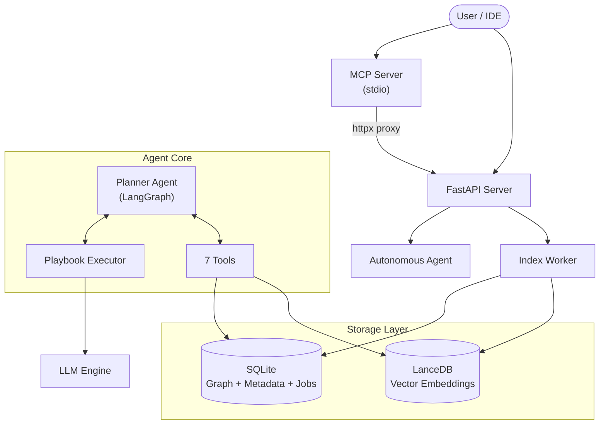

# CodeMind

**🧠 AI-Powered Code Intelligence Platform with Autonomous Agents**

CodeMind is a production-ready, **AI-powered code intelligence platform** designed to help developers, architects, and teams understand, document, and evolve complex codebases.

Unlike simple "chat with PDF" tools, CodeMind treats code as a **connected knowledge graph**, not just text. It combines **semantic vector search**, **AST-based structural analysis**, and **autonomous LangGraph agents** to provide deep, hallucination-free insights.

Whether you are onboarding a new developer, refactoring a legacy monolith, or generating up-to-date documentation, CodeMind provides the intelligence layer your team needs.

### 🌟 Why CodeMind?

*   **Beyond RegEx**: We don't just grep strings. We understand *classes*, *functions*, *calls*, and *dependencies* across 20+ languages via Tree-sitter.
*   **Agentic Reasoning**: Our autonomous agents don't just answer questions; they **plan**, **explore**, and **reason**. They can "Find all controllers using Auth v1, check their tests, and propose a migration plan."
*   **Scalable Architecture**: Built on **LanceDB** (vectors) and **SQLite** (graph + metadata), with WAL-mode concurrency, CodeMind scales to millions of lines of code without slowing down.
*   **Privacy First**: Runs 100% locally or in your private cloud. Your code never leaves your infrastructure unless you configure it to.
*   **MCP-Ready**: Ships with a built-in Model Context Protocol server — use CodeMind from Claude Desktop, Cursor, or VS Code Copilot.

---

## 🎯 Core Capabilities

- **⚡ Batch Indexing** — Process multiple repositories in parallel
- **🚀 Non-Blocking API** — Asynchronous execution with a standalone worker process
- **🔍 Hybrid Search** — Semantic + structural filtering with advanced file patterns
- **🤖 Autonomous Agents** — LangGraph-based Think → Act → Observe loop
- **📚 Repository Catalogs** — Auto-generated summaries with chunked vector search
- **🔄 Incremental Indexing** — LangGraph workflow with 7 pipeline stages
- **🔗 MCP Server** — Expose tools and resources to any MCP-compatible client

**Perfect for:**
- Onboarding new developers
- Generating documentation
- Understanding legacy code
- Impact analysis and refactoring
- Cross-file dependency tracing

---

## ✨ Key Features

### 1. Intelligent Code Search

**Three Search Modes:**

| Mode | Description |
|------|-------------|
| **Semantic** | Vector similarity via `BAAI/bge-base-en-v1.5` (768d) with query instruction prefixing |
| **Hybrid** | Combines vector similarity with structural filters (file types, patterns, symbol names, exclusions, regex) |
| **Structural** | Pure graph-based queries by file type, class name, or symbol |

```bash
POST /api/v1/search
{
  "query": "authentication middleware",
  "repo_id": "abc123",
  "search_mode": "hybrid",
  "filters": {
    "file_types": [".py", ".js"],
    "file_patterns": ["api", "auth"],
    "exclude_patterns": ["test_", "__pycache__"],
    "class_names": ["AuthMiddleware"]
  },
  "expand_context": true,
  "limit": 10
}
```

### 2. Autonomous Agents 🤖

CodeMind features a **Planner-Executor Autonomous Agent** powered by [LangGraph](https://github.com/langchain-ai/langgraph) that uses a **Think → Act → Observe** loop to solve complex problems.

**Capabilities:**
- ✅ **Multi-Step Planning** — Breaks down goals into tool/playbook steps
- ✅ **7 Specialized Tools** — Search, read files, trace callers/callees, resolve dependencies
- ✅ **Playbook Integration** — Invokes specialized playbooks (catalog_generator, catalog_search)
- ✅ **Self-Correction** — Retries on failure and adjusts strategy
- ✅ **Auto-Finish** — Automatically detects when the goal is met after 3 successful data retrievals
- ✅ **Allowed Playbooks** — Restrict agent to a whitelist of playbooks per request

**Workflow:**
```
1. POST /api/v1/agents/autonomous      → Start agent, get job_id
2. GET  /api/v1/agents/autonomous/{id}/status → Poll for progress
3. GET  /api/v1/agents/autonomous/{id}/result → Get final answer
```

**Example Request:**
```bash
POST /api/v1/agents/autonomous
{
  "goal": "What functions call the authenticate() method and which files import auth.py?",
  "repo_id": "abc123",
  "max_iterations": 10,
  "allowed_playbooks": ["catalog_search"]
}
```

### 3. Playbooks (Prompt-Based Strategies)

Playbooks are high-level strategies defined in Markdown that guide the Agent or LLM on how to solve specific tasks. They are auto-discovered from `*.md` files in the `playbooks/` directory.

| Playbook | Purpose |
|----------|---------|
| `catalog_generator` | Generates rich catalog summaries with metadata (tech stack, architecture, dependencies) |
| `catalog_search` | Searches across all repository catalogs with strict JSON output schema |

### 4. Repository Catalogs 📚

Catalogs are high-level summaries and documentation generated automatically by playbooks. They use a **dual-store architecture** for optimal retrieval:

- **SQLite** — Stores full catalog content (avoids context window limits)
- **LanceDB** — Stores chunked embeddings for semantic search

```bash
# Generate a catalog
POST /api/v1/catalogs
{
  "repo_id": "abc123",
  "playbook_name": "catalog_generator",
  "prompt": "Create a high-level architectural overview"
}

# Search across all catalogs
POST /api/v1/catalogs/search
{
  "query": "microservices architecture",
  "limit": 5,
  "min_score": 0.8
}
```

### 5. Incremental Indexing Pipeline

The indexing pipeline is orchestrated by **LangGraph** with 7 stages:

```
Detect Changes → Extract AST → Chunk Files → Generate Embeddings → Build Graph → Extract Relationships → Update Manifest
```

- **Incremental** — Only processes changed files based on Git diffs or content hashing
- **Deterministic** — Content-based IDs for all entities (repos, chunks, graph nodes)
- **Append-Only** — LanceDB used in append-only mode for immutable embedding history
- **Resilient** — AST extraction failures do not block indexing

### 6. Batch Indexing ⚡

Index multiple repositories at once using the batch processor.

```bash
# Create a config file
cat > batch_config.json << 'EOF'
[
  { "url": "https://github.com/fastapi/fastapi", "branch": "master" },
  { "url": "https://github.com/tiangolo/typer", "branch": "master" }
]
EOF

# Run batch indexing
./run_batch_indexer.sh batch_config.json --wait
```

---

## 🏗️ Architecture

### System Overview



### Triple-Process Architecture

CodeMind uses a **triple-process model** for safe concurrent access:

| Process | Role | Shared Resources |
|---------|------|------------------|
| **API Server** (`uvicorn`) | Handles HTTP requests, search, agent execution | SQLite (WAL), LanceDB |
| **Index Worker** (`python -m codemind.worker`) | Polls for pending jobs, runs indexing pipeline | SQLite (WAL), LanceDB |
| **MCP Server** (`python -m codemind.mcp`) | Exposes tools via Model Context Protocol for IDE clients | Proxies to API Server via httpx |

The API Server and Index Worker share SQLite in **WAL mode** (Write-Ahead Logging) with `busy_timeout=5000ms` for safe concurrent reads and writes. The MCP Server is a thin HTTP proxy that forwards MCP tool calls to the API Server.

### Technology Stack

| Layer | Technology |
|-------|------------|
| **API** | [FastAPI](https://fastapi.tiangolo.com/) |
| **Agent** | [LangGraph](https://github.com/langchain-ai/langgraph) |
| **Vector DB** | [LanceDB](https://lancedb.com/) (append-only) |
| **Graph + Metadata** | [SQLite](https://sqlite.org/) via SQLAlchemy (WAL mode) |
| **AST Parsing** | [Tree-sitter](https://tree-sitter.github.io/) (20+ languages) |
| **Embeddings** | [BAAI/bge-base-en-v1.5](https://huggingface.co/BAAI/bge-base-en-v1.5) (768d) |
| **MCP** | [Model Context Protocol](https://modelcontextprotocol.io/) via FastMCP + httpx |
| **Frontend** | React + Vite |

### Embedding Providers

| Provider | Backend | Config |
|----------|---------|--------|
| **Local** | SentenceTransformers (CPU/GPU) | Default — no config needed |
| **Remote** | OpenAI-compatible (Ollama, vLLM, etc.) | Set `EMBEDDING_API_URL` |
| **Apigee** | Enterprise embedding API | Set `APIGEE_*` env vars |

### LLM Providers

| Provider | Backend | Config |
|----------|---------|--------|
| **Local** | LM Studio / Any OpenAI-compatible server | `LLM_PROVIDER=local` |
| **Ollama** | Ollama | `LLM_PROVIDER=ollama` |
| **Apigee** | Enterprise API gateway | `LLM_PROVIDER=apigee` |
| **Enterprise** | Custom enterprise endpoint | `LLM_PROVIDER=enterprise` |

---

## 🚀 Quick Start

### Prerequisites
1. **Python 3.10+**
2. **Local LLM Server** (e.g., LM Studio/Ollama) OR OpenAI API Key

### Installation

```bash
# Clone repository
git clone <your-repo-url>
cd cmind

# Create virtual environment
python -m venv .venv
source .venv/bin/activate

# Install dependencies
pip install -e ".[dev]"
```

### Configuration

Create a `.env` file (see `.env.example` for all options):

```env
# LLM Provider
LLM_PROVIDER=local                        # local, ollama, apigee, enterprise
LOCAL_LLM_URL=http://localhost:1234/v1
LOCAL_LLM_MODEL=openai/gpt-4o
LLM_MAX_TOKENS=100000

# Embedding (Local — default, no config needed)
EMBEDDING_MODEL=BAAI/bge-base-en-v1.5

# OR Remote (OpenAI-compatible)
# EMBEDDING_API_URL=http://localhost:11434/v1
# EMBEDDING_API_KEY=ollama
# EMBEDDING_MODEL=nomic-embed-text

# MCP Server
# CODEMIND_API_URL=http://localhost:8000    # default
# CODEMIND_TIMEOUT=120                      # seconds

# GitHub Access (for private repos)
# GIT_ACCESS_TOKEN=your_github_token_here
```

### Start the Server

```bash
# Terminal 1: Start the API server
uvicorn codemind.api.server:app --reload
# Server runs on http://localhost:8000
# API docs: http://localhost:8000/docs

# Terminal 2: Start the index worker
python -m codemind.worker.index_worker

# Terminal 3 (optional): Start the MCP server
python -m codemind.mcp
```

### Start the Frontend

```bash
cd frontend
npm install
npm run dev
# Frontend runs on http://localhost:5173
```

### Running Tests

```bash
# Run all tests (unit + E2E, integration tests auto-skip without server)
pytest

# Run only unit/E2E tests (no server required)
pytest tests/test_api/ tests/test_agents/ -v

# Run MCP server tests
pytest tests/test_mcp/ -v

# Run with coverage report
pytest --cov=codemind --cov-report=term-missing

# Run integration tests (requires running server on localhost:8000)
uvicorn codemind.api.server:app &
pytest tests/test_search_integration.py -v
```

---

## 🔗 MCP Server (Model Context Protocol)

CodeMind ships with an MCP server that lets any MCP-compatible client (Claude Desktop, Cursor, VS Code Copilot) access your indexed codebases. The MCP server is a thin HTTP proxy — it forwards MCP tool calls to the running FastAPI server via `httpx`.

### Start the MCP Server

```bash
# Requires the CodeMind API server to be running
python -m codemind.mcp

# Or via console script
codemind-mcp
```

### Claude Desktop Configuration

Add to `~/Library/Application Support/Claude/claude_desktop_config.json`:

```json
{
  "mcpServers": {
    "codemind": {
      "command": "/path/to/cmind/.venv/bin/python",
      "args": ["-m", "codemind.mcp"],
      "env": {
        "CODEMIND_API_URL": "http://localhost:8000"
      }
    }
  }
}
```

### Available MCP Tools

| Tool | Category | Proxies To | Description |
|------|----------|-----------|-------------|
| `catalog_search` | Code Intelligence | `POST /api/v1/catalogs/search` | Semantic search across all repo catalogs |
| `code_search` | Code Intelligence | `POST /api/v1/search` | Hybrid search over indexed source code |
| `catalog_browse` | Code Intelligence | `GET /api/v1/catalogs/{repo_id}` | Get full catalog for a repository |
| `agent_execute` | Autonomous Agent | `POST /api/v1/agents/autonomous` | Start an autonomous agent with a goal |
| `agent_status` | Autonomous Agent | `GET /api/v1/agents/autonomous/{id}/status` | Poll agent job status |
| `agent_result` | Autonomous Agent | `GET /api/v1/agents/autonomous/{id}/result` | Get completed agent result |

### Available MCP Resources

| Resource URI | Proxies To | Description |
|-------------|-----------|-------------|
| `codemind://repos` | `GET /api/v1/repos` | List all indexed repositories |
| `codemind://health` | `GET /api/v1/health` | Server health + embedding model info |

---

## 🔌 API Reference

### Core
| Method | Endpoint | Description |
|--------|----------|-------------|
| `GET` | `/api/v1/health` | Health check with embedding model info |
| `POST` | `/api/v1/index` | Index a repository (local path or Git URL) |
| `GET` | `/api/v1/repos` | List all indexed repositories |
| `GET` | `/api/v1/jobs/{id}` | Check indexing job status |
| `GET` | `/api/v1/stats` | System statistics |

### Search & Graph
| Method | Endpoint | Description |
|--------|----------|-------------|
| `POST` | `/api/v1/search` | Semantic, hybrid, or structural search |
| `POST` | `/api/v1/graph/query` | Structural graph queries (files, classes, functions, symbols) |

### Autonomous Agent
| Method | Endpoint | Description |
|--------|----------|-------------|
| `POST` | `/api/v1/agents/autonomous` | Start autonomous agent with a natural language goal |
| `GET` | `/api/v1/agents/autonomous/{id}/status` | Poll agent job status (pending/running/completed/failed) |
| `GET` | `/api/v1/agents/autonomous/{id}/result` | Get final result (425 if still running) |

### Catalogs
| Method | Endpoint | Description |
|--------|----------|-------------|
| `POST` | `/api/v1/catalogs` | Create catalog entry via playbook |
| `GET` | `/api/v1/catalogs/{repo_id}` | Get all catalog entries for a repo |
| `POST` | `/api/v1/catalogs/search` | Semantic search across all catalogs |

> 💡 Full interactive API docs available at `http://localhost:8000/docs` when the server is running.

> 📬 A **Postman collection** (`CodeMind_API.postman_collection.json`) is included in the repo root with example requests for all endpoints.

---

## 📁 Project Structure

```
cmind/
├── src/codemind/
│   ├── agents/          # PlannerAgent, PlannerState, PlaybookSelector
│   ├── api/             # FastAPI server, autonomous agent endpoints
│   ├── batch/           # Batch indexing CLI
│   ├── graph/           # SQLite graph adapter, GraphBuilder, GraphQueryService
│   ├── indexer/         # AST extraction, chunking, embedding generation
│   ├── jobs/            # Job management (queue, status tracking)
│   ├── llm/             # Multi-provider LLM clients (Local, Ollama, Apigee, Enterprise)
│   ├── mcp/             # MCP server (Model Context Protocol proxy)
│   ├── playbooks/       # Playbook registry, executor, parser, tools
│   ├── storage/         # SQLAlchemy database, LanceDB, ManifestManager
│   ├── utils/           # Git utilities, GitHub client
│   ├── worker/          # Standalone IndexWorker process
│   └── workflows/       # LangGraph indexing pipeline (7 stages)
├── playbooks/           # Markdown playbook definitions
│   ├── catalog_generator.md
│   └── catalog_search.md
├── frontend/            # React + Vite frontend
├── tests/               # 82 tests (unit, E2E, MCP, integration)
│   ├── test_api/        # FastAPI TestClient E2E tests
│   ├── test_agents/     # PlannerAgent + PlaybookExecutor tests
│   ├── test_indexer/    # Chunker, file filter tests
│   ├── test_mcp/        # MCP server tool + resource tests
│   ├── test_storage/    # Database, LanceDB tests
│   └── conftest.py      # MockLLMDriver, MockEmbedder, in-memory DB fixtures
├── docs/                # Architecture docs, API reference, guides
├── CodeMind_API.postman_collection.json  # Postman collection (26 requests)
├── pyproject.toml       # Project config (black, ruff, mypy, pytest)
└── .env.example         # Configuration template
```

---

## 🧪 Test Suite

| Suite | Tests | Coverage |
|-------|-------|----------|
| **E2E API** (`test_api/`) | 15 | FastAPI TestClient — no server needed |
| **Agent Planner** (`test_agents/`) | 16 | Think-Act-Observe loop, tool dispatch, allowed playbooks |
| **MCP Server** (`test_mcp/`) | 14 | All 6 tools + 2 resources, mocked httpx |
| **Storage** (`test_storage/`) | 10 | Database, LanceDB, manifest |
| **Indexer** (`test_indexer/`) | 15 | Chunking, file filters, change detection |
| **Integration** | 23 | Requires running server (auto-skipped in CI) |
| **Total** | **82 passed, 23 skipped** | **~38% overall** |

All unit and E2E tests run without external dependencies (no server, no LLM, no GPU).

---

**CodeMind** — *AI-Powered Autonomous Code Intelligence*