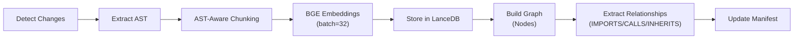
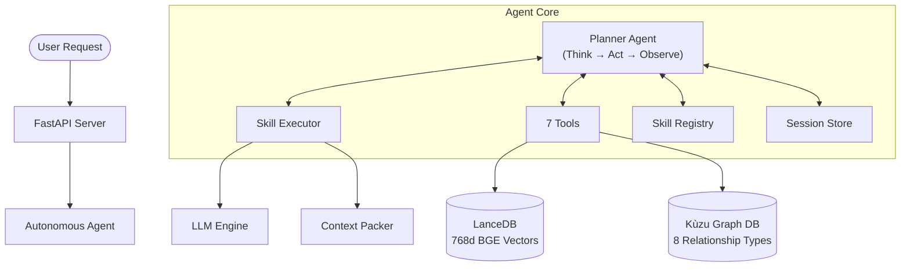

# CodeMind

**🧠 AI-Powered Code Intelligence Platform with Autonomous Agents**

CodeMind is a production-ready code analysis platform that combines semantic search, graph-based code understanding, multi-language AST analysis, and autonomous LangGraph agents to provide deep, cross-file insights into any codebase.

---

## 🎯 What is CodeMind?

CodeMind helps you understand, document, and analyze codebases using:

- **🔍 Hybrid Search** — Semantic vector search + graph-based structural queries
- **🤖 Multi-Tool Autonomous Agents** — LangGraph agents with 7 specialized tools for multi-step reasoning
- **📊 Rich Knowledge Graphs** — Kùzu graph DB with cross-file relationships (imports, calls, inheritance)
- **🌳 Multi-Language AST** — Tree-sitter powered parsing for 20+ languages
- **🧩 AST-Aware Chunking** — Chunks code at function/class boundaries, not arbitrary offsets
- **💾 Append-Only Storage** — Immutable, incremental indexing with LanceDB
- **🧠 Session Memory** — Multi-turn conversation context with LRU eviction
- **⚙️ Fully Configurable** — All token limits derive from a single `LLM_MAX_TOKENS` environment variable
- **🚀 Non-Blocking API** — Agent runs asynchronously; server stays responsive

**Perfect for:**
- Onboarding new developers
- Generating documentation
- Understanding legacy code
- Impact analysis and refactoring
- Cross-file dependency tracing
- Automated code analysis

---

## ✨ Key Features

### 1. Intelligent Code Search

**Semantic Search** — Powered by `BAAI/bge-base-en-v1.5` (768d) with query instruction prefixing for asymmetric retrieval.

```bash
POST /api/v1/search
{
  "query": "authentication middleware",
  "repo_id": "abc123",
  "search_mode": "semantic",
  "limit": 10
}
```

**Hybrid Search** — Combines vector similarity with graph-based structural filters.

```bash
POST /api/v1/search
{
  "query": "database models",
  "repo_id": "abc123",
  "search_mode": "hybrid",
  "filters": {
    "file_type": ".py",
    "class_name": "BaseModel",
    "exclude_patterns": ["tests"]
  }
}
```

### 2. Multi-Tool Autonomous Agent 🤖

CodeMind features a **Planner-Executor Autonomous Agent** that can chain multiple skills and tools for complex, multi-step reasoning.

**Capabilities:**
- ✅ **Multi-Step Planning** — Breaks down goals into tool/skill steps (no single-skill limit)
- ✅ **7 Specialized Tools** — Search, read files, trace callers/callees, resolve dependencies
- ✅ **Skill + Tool Dispatch** — Skills invoke LLM reasoning; tools retrieve data directly
- ✅ **Context Intelligence** — Token-aware context packing with overflow handling
- ✅ **Session Memory** — Multi-turn conversations with automatic history management
- ✅ **Self-Correction** — Retries on failure and adjusts strategy
- ✅ **Auto-Finish** — Automatically completes after sufficient successful data retrievals
- ✅ **Non-Blocking Execution** — Runs via `asyncio.create_task()`, keeping the server responsive

**Example Request:**
```bash
POST /api/v1/agents/autonomous
{
  "goal": "What functions call the authenticate() method and which files import auth.py?",
  "repo_id": "abc123"
}
```

### 3. How the Agent Works

The agent follows a **Think → Act → Observe** loop powered by LangGraph:

```
User Goal
  │
  ▼
┌─────────────────────────────────────────────────┐
│  THINK                                          │
│  LLM selects next action (SKILL / TOOL / FINISH)│
│  • Parses standard, model-native, and JSON formats│
│  • Auto-finishes after N successful data runs    │
│  • Blocks FINISH until at least 1 data retrieval │
└──────────┬──────────────────────────────────────┘
           │
           ▼
┌─────────────────────────────────────────────────┐
│  ACT                                            │
│  Executes the selected skill or tool            │
│  • Skills → SkillExecutor (search + LLM generate)│
│  • Tools → Direct data retrieval (no LLM)       │
└──────────┬──────────────────────────────────────┘
           │
           ▼
┌─────────────────────────────────────────────────┐
│  OBSERVE                                        │
│  Processes results and logs output sizes         │
│  Loops back to THINK for next iteration          │
└──────────┬──────────────────────────────────────┘
           │
           ▼
┌─────────────────────────────────────────────────┐
│  FINISH                                         │
│  Synthesizes final answer:                      │
│  • Uses last skill output directly (fast path)  │
│  • OR calls LLM to merge multiple data sources  │
│  • Logs progress at every step                  │
└─────────────────────────────────────────────────┘
```

**Decision Flow in `_think`:**
1. Count successful data retrievals from previous observations
2. If count ≥ auto-finish threshold → finish immediately (no LLM call)
3. Otherwise, ask LLM to select next SKILL/TOOL/FINISH
4. LLM output is parsed through multi-format parser (standard `SKILL:`, model-native `<|channel|>`, raw JSON, fallback)

**Action Parsing (`_parse_action`):**
- Handles `SKILL: <name>` / `TOOL: <name>` / `FINISH: <answer>` standard format
- Handles model-native formats (e.g., `<|message|>{"query":"..."}`)
- Extracts raw JSON from unstructured output
- Auto-finishes when data exists but output format is unrecognized

### 4. Agent Tool System

The agent has **7 tools** available for multi-step code understanding:

| Tool | Type | Description |
|------|------|-------------|
| `search_codebase` | Semantic | Vector search across the codebase |
| `read_file` | Direct | Read specific file content by path |
| `search_symbol` | Graph | Find class/function by name |
| `get_callers` | Graph | Find all functions that call a given function |
| `get_callees` | Graph | Find all functions called by a given function |
| `get_dependencies` | Graph | File-level import dependencies (imports/imported_by) |
| `list_files` | Graph | List files matching a pattern or type |

**Tool vs Skill:**
- **Tools** return raw data directly (no LLM involved) — fast, deterministic
- **Skills** use LLM reasoning over retrieved code — slower, more intelligent

### 5. Skill System (Prompt-Based)

Higher-level capabilities are defined in **Markdown** skill files — not hardcoded logic. Skills are discovered at startup from the `skills/` directory.

**Active Skills:**
- **📝 Documentation Generator** — Creates detailed, structured documentation (README, architectural overview, Mermaid diagrams)
- **🔍 QA (Question Answering)** — Finds and explains code snippets with grounded answers

**How Skills Work:**
```
Skill .md file defines:
  ├── Description + intent signals (for matching)
  ├── System prompt (instructions for the LLM)
  ├── Search queries (how to find relevant code)
  └── Output format (markdown, JSON, etc.)

Executor Pipeline:
  1. Parse skill config from .md file
  2. Search codebase using skill's query patterns
  3. Pack code chunks into context (token-aware)
  4. Generate output via LLM (single-pass or map-reduce)
  5. Return structured result
```

**Adding New Skills:** Create a `.md` file in `skills/` following the schema — no code changes needed.

### 6. Skill Executor & Map-Reduce

The `SkillExecutor` runs a 4-node LangGraph workflow:

```
parse_input → search_code → pack_context → llm_generate
```

**Context-Aware Generation:**
- If total tokens fit within `MAX_CONTEXT` (70% of `LLM_MAX_TOKENS`) → **single-pass generation**
- If context is too large → **map-reduce**:
  1. Split code into batches (up to 5)
  2. Generate analysis for each batch independently
  3. Merge all batch results into one cohesive output

**All token budgets scale proportionally with `LLM_MAX_TOKENS`:**

| Budget | Formula | Example (100K) |
|--------|---------|----------------|
| MAX_CONTEXT threshold | `cfg × 0.7` | 70,000 |
| Code context (single-pass) | `cfg × 0.5` | 50,000 |
| Single-pass output | `cfg × 0.3` | 30,000 |
| Batch chunk size | `cfg × 0.15` | 15,000 |
| Batch output | `cfg × 0.1` | 10,000 |
| Reduce output | `cfg × 0.3` | 30,000 |

### 7. Rich Code Graph

**Powered by Kùzu Graph Database:**

**Node Types:** Repository, File, Class, Function

**Relationship Types:**

| Relationship | Description |
|---|---|
| `CONTAINS` | Repository → File |
| `DECLARES_CLASS` | File → Class |
| `DECLARES_FUNCTION` | File → Function |
| `HAS_METHOD` | Class → Function |
| `IMPORTS` | File → File (cross-file) |
| `CALLS` | Function → Function (cross-file) |
| `INHERITS` | Class → Class (cross-file) |
| `USES_TYPE` | Function → Class |

**Cross-File Queries:**
- `get_callers(func)` — Who calls this function?
- `get_callees(func)` — What does this function call?
- `get_file_dependencies(file)` — What does this file import?
- `get_file_dependents(file)` — What imports this file?
- `get_impact_radius(symbol)` — What changes if I modify this symbol?
- `get_class_hierarchy(class)` — Parent/child class tree

### 8. Multi-Language AST Extraction

**Tree-sitter powered** parsing with per-language node type mappings:

| Language | Extensions | Symbols | Imports | Calls |
|----------|-----------|---------|---------|-------|
| Python | `.py` | ✅ | ✅ | ✅ |
| JavaScript | `.js`, `.jsx` | ✅ | ✅ | ✅ |
| TypeScript | `.ts`, `.tsx` | ✅ | ✅ | ✅ |
| Go | `.go` | ✅ | ✅ | ✅ |
| Java | `.java` | ✅ | ✅ | ✅ |
| Rust | `.rs` | ✅ | ✅ | ✅ |
| C / C++ | `.c`, `.cpp`, `.h` | ✅ | ✅ | ✅ |
| C# | `.cs` | ✅ | ✅ | ✅ |
| Ruby | `.rb` | ✅ | ✅ | ✅ |
| PHP | `.php` | ✅ | ✅ | ✅ |
| Kotlin | `.kt` | ✅ | ✅ | ✅ |
| Scala | `.scala` | ✅ | ✅ | ✅ |
| Swift | `.swift` | ✅ | ✅ | ✅ |
| Dart | `.dart` | ✅ | ✅ | ✅ |
| Lua | `.lua` | ✅ | ✅ | ✅ |
| Zig | `.zig` | ✅ | ✅ | ✅ |
| Elixir | `.ex`, `.exs` | ✅ | ✅ | ✅ |
| Haskell | `.hs` | ✅ | ✅ | ✅ |
| **JSP** | `.jsp`, `.jspx` | ❌ | ❌ | ❌ | (Semantic-Only)
| HTML/CSS | `.html`, `.css` | ❌ | ❌ | ❌ | (Semantic-Only)

**Extracts:** Classes, functions, methods, interfaces, structs, traits, enums, imports, base classes, parameters, docstrings.

### 9. AST-Aware Chunking

Instead of splitting code at arbitrary character boundaries, CodeMind chunks at **function and class boundaries**:

- One chunk per function/class (preserves semantic meaning)
- Large symbols are sub-split with line overlap
- Uncovered module-level code (imports, constants) gets its own chunk
- Falls back to character-based chunking for unsupported languages
- Each chunk carries `symbol_name`, `symbol_type`, and `language` metadata

### 10. Context Window Intelligence

**ContextPacker** ensures the LLM never receives more than it can handle:

- Sorts chunks by relevance score (highest first)
- Deduplicates by content
- Packs within a configurable character budget
- Adds truncation notices for overflow
- Summarizes excluded chunks

### 11. LLM Configuration

All LLM interactions are driven by a unified configuration loaded from environment variables:

**Supported Providers:**

| Provider | Env Vars | Description |
|----------|----------|-------------|
| `local` | `LOCAL_LLM_URL`, `LOCAL_LLM_MODEL` | LM Studio, vLLM, or any OpenAI-compatible server |
| `ollama` | `OLLAMA_BASE_URL` | Ollama local models |
| `apigee` | `APIGEE_MODEL`, `APIGEE_TIMEOUT` | Enterprise API gateway |
| `enterprise` | Enterprise config | Corporate LLM services |

**Configuration (`LLMConfig`):**

```python
@dataclass
class LLMConfig:
    provider: LLMProvider
    model: str
    api_key: Optional[str] = None
    base_url: Optional[str] = None
    temperature: float = 0.1
    max_tokens: int = 4000        # Overridden by LLM_MAX_TOKENS
    timeout: float = 600.0        # Seconds
```

**Token Budget Scaling:**

Every `max_tokens` parameter in the system derives from `LLM_MAX_TOKENS`:

| Component | Budget | Formula |
|-----------|--------|---------|
| **Planner thinking** | Action selection | `max(256, cfg ÷ 20)` → ~5% |
| **Planner synthesis** | Final answer merge | `max(512, cfg ÷ 10)` → ~10% |
| **Executor single-pass** | Skill output generation | `cfg × 0.3` → 30% |
| **Executor code context** | Code fed to LLM | `cfg × 0.5` → 50% |
| **Executor MAX_CONTEXT** | Single-pass threshold | `cfg × 0.7` → 70% |
| **Executor batch chunk** | Per-batch code size | `cfg × 0.15` → 15% |
| **Executor batch output** | Per-batch LLM output | `cfg × 0.1` → 10% |
| **Executor reduce output** | Final merge output | `cfg × 0.3` → 30% |

### 12. Configurable Embedding System

CodeMind supports both cloud-based (HuggingFace) and local embedding models. All parameters are externalized to environment variables.

**Supported Configurations:**
- **Model Loading**: Load from HuggingFace (`BAAI/bge-base-en-v1.5`) or local directory paths.
- **Auto-Detection**: The system automatically detects embedding dimensions from the loaded model.
- **Dynamic Schema**: LanceDB storage automatically adapts its schema to match the model's dimensions.

| Variable | Default | Purpose |
|----------|---------|---------|
| `EMBEDDING_MODEL` | `BAAI/bge-base-en-v1.5` | Model name or absolute local path |
| `EMBEDDING_DIMENSION` | `768` | Vector dimensions (e.g., 768 for BGE, 384 for MiniLM) |
| `EMBEDDING_MAX_TOKENS` | `512` | Max sequence length for the model |
| `EMBEDDING_BATCH_SIZE` | `32` | Chunks processed per batch during indexing |
| `EMBEDDING_QUERY_PREFIX` | BGE instruction | Custom instruction prefix for query Encoding |
| **Normalization** | ✅ L2 | Embeddings are normalized by default |

> [!IMPORTANT]
> Changing the embedding model or dimensions requires deleting `data/lancedb/` and re-indexing all repositories to avoid vector dimension mismatches.

### 13. Non-Blocking Agent Execution

The autonomous agent runs as a background coroutine via `asyncio.create_task()`:

```python
# POST /api/v1/agents/autonomous → returns job_id immediately
asyncio.create_task(run_autonomous_task(job_id, goal, repo_id, max_iterations))
```

- Server stays fully responsive while the agent works
- Poll status via `GET /api/v1/agents/autonomous/{job_id}/status`
- Retrieve result via `GET /api/v1/agents/autonomous/{job_id}/result`
- Explicit `await asyncio.sleep(0)` yield points in every planner node

### 14. Indexing Pipeline

The indexing process is orchestrated by LangGraph as an 8-step workflow:



**Features:**
- **Incremental** — Only processes changed files (Git-based or hash-based detection)
- **Append-Only** — LanceDB storage is immutable; old data is never modified
- **Deterministic IDs** — Content-based hashing ensures stable identities across re-indexes
- **Batch Embeddings** — Processes 32 chunks at a time for efficiency

---

## 🏗️ Architecture

### System Overview



### Technology Stack

| Layer | Technology | Purpose |
|-------|-----------|---------| 
| **API** | [FastAPI](https://fastapi.tiangolo.com/) | REST endpoints, async request handling |
| **Agent** | [LangGraph](https://github.com/langchain-ai/langgraph) | Workflow orchestration (planner + executor) |
| **Vector DB** | [LanceDB](https://lancedb.com/) | Semantic search (768d, append-only) |
| **Graph DB** | [Kùzu](https://kuzudb.com/) | Code relationships (8 edge types) |
| **Embeddings** | [BAAI/bge-base-en-v1.5](https://huggingface.co/BAAI/bge-base-en-v1.5) | 768d, query instruction prefix |
| **AST Parsing** | [Tree-sitter](https://tree-sitter.github.io/) | 20+ language support |
| **LLM** | Local (LM Studio) / OpenAI-compatible | Code reasoning, configurable via env |
| **Session** | In-memory (LRU) | Multi-turn conversation memory |

---

## 🚀 Quick Start

### Prerequisites
1. **Python 3.12+**
2. **Local LLM Server** (e.g., LM Studio running on `localhost:1234`)

### Installation

```bash
# Clone repository
git clone <your-repo-url>
cd cmind

# Create virtual environment
python -m venv .venv
source .venv/bin/activate

# Install dependencies
pip install -e ".[dev]"
```

### Configuration

Create a `.env` file in the project root:

```env
# LLM Provider
LLM_PROVIDER=local                        # Options: local, ollama, apigee, enterprise
LOCAL_LLM_URL=http://localhost:1234/v1     # LLM server endpoint
LOCAL_LLM_MODEL=openai/gpt-oss-20b        # Model name

# Token Configuration (all budgets scale from this single value)
LLM_MAX_TOKENS=100000

# Embedding Configuration
EMBEDDING_MODEL=BAAI/bge-base-en-v1.5
EMBEDDING_DIMENSION=768
EMBEDDING_MAX_TOKENS=512
EMBEDDING_BATCH_SIZE=32
EMBEDDING_QUERY_PREFIX="Represent this sentence for searching relevant passages: "
```

### Start the Server

```bash
# Start FastAPI server
uvicorn codemind.api.server:app --reload

# Server runs on http://localhost:8000
# API docs: http://localhost:8000/docs
```

### Usage Examples

**1. Index a Repository**
```bash
curl -X POST http://localhost:8000/api/v1/index \
  -H "Content-Type: application/json" \
  -d '{"repo_path": "/path/to/local/repo"}'
```

**2. Semantic Search**
```bash
curl -X POST http://localhost:8000/api/v1/search \
  -H "Content-Type: application/json" \
  -d '{
    "query": "how does authentication work",
    "repo_id": "<your_repo_id>",
    "search_mode": "semantic"
  }'
```

**3. Run Autonomous Agent**
```bash
# Start the agent (returns immediately with job_id)
curl -X POST http://localhost:8000/api/v1/agents/autonomous \
  -H "Content-Type: application/json" \
  -d '{
    "goal": "Generate a detailed Mermaid diagram of the application architecture",
    "repo_id": "<your_repo_id>"
  }'

# Poll status
curl http://localhost:8000/api/v1/agents/autonomous/{job_id}/status

# Get result when completed
curl http://localhost:8000/api/v1/agents/autonomous/{job_id}/result
```

**4. Graph Queries**
```bash
# Find all callers of a function
curl "http://localhost:8000/api/v1/graph/callers?function_name=authenticate&repo_id=<repo_id>"

# Get file dependencies
curl "http://localhost:8000/api/v1/graph/dependencies?file_path=src/auth.py&repo_id=<repo_id>"
```

---

## 📁 Project Structure

```
cmind/
├── .env                        # Environment configuration
├── src/codemind/
│   ├── api/                    # FastAPI routes
│   │   ├── server.py           # Main server + search endpoints
│   │   └── autonomous_agents.py # Agent API (async job management)
│   ├── agents/                 # Autonomous Agent System
│   │   ├── planner.py          # Multi-step planner (Think→Act→Observe→Finish)
│   │   ├── planner_state.py    # Agent state TypedDict
│   │   └── session_store.py    # Multi-turn conversation memory (LRU)
│   ├── skills/                 # Skill Executors & Tools
│   │   ├── executors.py        # Skill execution + ContextPacker + map-reduce
│   │   ├── tools.py            # 7 agent tools (search, read, graph queries)
│   │   ├── registry.py         # Skill discovery from .md files
│   │   ├── parsers.py          # Skill markdown file parser
│   │   ├── token_utils.py      # Token estimation + chunk splitting
│   │   └── schema.py           # Pydantic models
│   ├── graph/                  # Kùzu Graph Database
│   │   ├── kuzu_graph.py       # Schema + 8 relationship types
│   │   ├── graph_query.py      # Cross-file query service
│   │   └── graph_db.py         # GraphBuilder (nodes + edges)
│   ├── indexer/                # Indexing Pipeline
│   │   ├── ast_extractor.py    # Multi-language AST (tree-sitter, 20+ langs)
│   │   ├── ast_chunker.py      # AST-boundary chunking
│   │   ├── call_extractor.py   # Function call site extraction
│   │   ├── import_resolver.py  # Cross-language import → file resolution
│   │   ├── embedder.py         # BGE embeddings (768d, batched)
│   │   ├── chunker.py          # CodeChunk model (with symbol metadata)
│   │   ├── change_detector.py  # Incremental change detection
│   │   ├── git_detector.py     # Git-based change detection
│   │   ├── hash_detector.py    # Hash-based change detection
│   │   └── file_filters.py     # File type filtering (59 extensions)
│   ├── storage/                # Data Storage
│   │   ├── lancedb_storage.py  # Vector DB (768d schema, auto-migration)
│   │   └── manifest.py         # Repository/file manifests
│   ├── workflows/              # Orchestration
│   │   └── indexing_workflow.py # 8-step LangGraph indexing pipeline
│   ├── llm/                    # LLM Integration
│   │   ├── base.py             # LLMConfig, LLMDriver (abstract)
│   │   ├── factory.py          # LLM client factory (reads env vars)
│   │   ├── providers.py        # Local/Ollama/API drivers
│   │   └── agents/             # LangGraph doc generator agents
│   ├── jobs/                   # Background job management
│   └── utils/                  # Shared utilities
├── skills/                     # Skill Definitions (.md files)
│   ├── qa.md                   # Question-answering skill
│   └── documentation.md        # Documentation generation skill
├── docs/                       # Documentation
└── tests/                      # Test suite
```

---

## 🔌 API Reference

### Core Endpoints

| Method | Endpoint | Description |
|--------|----------|-------------|
| `POST` | `/api/v1/index` | Index a repository |
| `POST` | `/api/v1/search` | Search codebase (semantic/hybrid) |
| `GET` | `/api/v1/health` | Health check (returns version + embedding config) |
| `GET` | `/api/v1/stats` | System statistics (job counts) |
| `GET` | `/docs` | Swagger UI |

### Agent Endpoints

| Method | Endpoint | Description |
|--------|----------|-------------|
| `POST` | `/api/v1/agents/autonomous` | Start autonomous agent job |
| `GET` | `/api/v1/agents/autonomous/{job_id}/status` | Poll agent job status |
| `GET` | `/api/v1/agents/autonomous/{job_id}/result` | Get final agent output |

### Graph Endpoints

| Method | Endpoint | Description |
|--------|----------|-------------|
| `POST` | `/api/v1/graph/query` | Unified GraphQL-like query for code structure |

**Graph Query Request Body:**
```json
{
  "repo_id": "c03b42a23b1fdc85",
  "query_type": "files",   // "files", "classes", "functions", "symbol"
  "pattern": "api",        // Optional pattern
  "file_type": ".py",      // Optional filter
  "class_name": "Planner", // For finding methods in a class
  "symbol_name": "exec"    // For exact symbol lookup
}
```


---

## 📝 License

[To be determined]

---

**CodeMind** — *AI-Powered Autonomous Code Intelligence*
