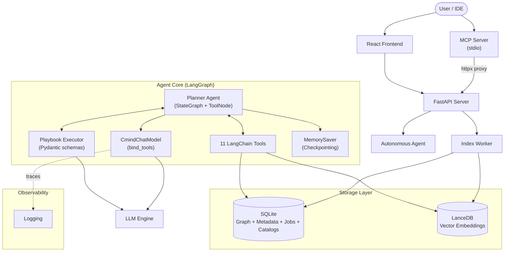

# CodeMind

**🧠 AI-Powered Code Intelligence Platform with Autonomous Agents**

CodeMind is a production-ready, **AI-powered code intelligence platform** designed to help developers, architects, and teams understand, document, and evolve complex codebases.

Unlike simple "chat with PDF" tools, CodeMind treats code as a **connected knowledge graph**, not just text. It combines **semantic vector search**, **AST-based structural analysis**, and **autonomous LangGraph agents** to provide deep, hallucination-free insights.

Whether you are onboarding a new developer, refactoring a legacy monolith, or generating up-to-date documentation, CodeMind provides the intelligence layer your team needs.

### 🌟 Why CodeMind?

*   **Beyond RegEx**: We don't just grep strings. We understand *classes*, *functions*, *calls*, and *dependencies* across 20+ languages via Tree-sitter.
*   **Agentic Reasoning**: Our autonomous agents don't just answer questions; they **plan**, **explore**, and **reason**. They can "Find all controllers using Auth v1, check their tests, and propose a migration plan."
*   **LangChain-Native**: Built on **LangChain Core** + **LangGraph** — the industry-standard agent framework. Structured output via Pydantic, `bind_tools()`, `ToolNode`, and `MemorySaver` checkpointing.
*   **Scalable Architecture**: Built on **LanceDB** (vectors) and **SQLite** (graph + metadata), with WAL-mode concurrency, CodeMind scales to millions of lines of code without slowing down.
*   **Privacy First**: Runs 100% locally or in your private cloud. Your code never leaves your infrastructure unless you configure it to.
*   **Observable**: Standard structured logging and performance metrics for all LLM calls and tool invocations.
*   **MCP-Ready**: Ships with a built-in Model Context Protocol server — use CodeMind from Claude Desktop, Cursor, or VS Code Copilot.

---

## 🎯 Core Capabilities

- **⚡ Batch Indexing** — Process multiple repositories in parallel
- **🚀 Non-Blocking API** — Asynchronous execution with a standalone worker process
- **🔍 Hybrid Search** — Semantic + structural filtering with advanced file patterns
- **🤖 Autonomous Agents** — LangGraph-based Think → Act → Observe loop with `ToolNode` + `bind_tools()`
- **📚 Repository Catalogs** — Auto-generated summaries with chunked vector search & Pydantic-validated output
- **🔄 Incremental Indexing** — LangGraph workflow with 7 pipeline stages
- **🔗 MCP Server** — Expose tools and resources to any MCP-compatible client
- **💾 Checkpointing** — LangGraph `MemorySaver` for agent state persistence per job
- **📊 Observability** — Standard structured logging for all LLM operations
- **🖥️ React Frontend** — Modern UI for catalog search, repository management, and admin operations

**Perfect for:**
- Onboarding new developers
- Generating documentation
- Understanding legacy code
- Impact analysis and refactoring
- Cross-file dependency tracing
- Enterprise software catalog management
- Non-Functional Requirement (NFR) validation against codebases
- Architecture-as-Code — extracting and validating architectural patterns
- Tech debt identification and quantification
- Application manifest generation (dependencies, APIs, contracts)
- Codebase health scoring and quality assessment
- Migration planning and risk analysis

---

## ✨ Key Features

### 1. Intelligent Code Search

**Three Search Modes:**

| Mode | Description |
|------|-------------|
| **Semantic** | Vector similarity via `BAAI/bge-base-en-v1.5` (768d) with query instruction prefixing |
| **Hybrid** | Combines vector similarity with structural filters (file types, patterns, symbol names, exclusions, regex) |
| **Structural** | Pure graph-based queries by file type, class name, or symbol |

```bash
POST /api/v1/search
{
  "query": "authentication middleware",
  "repo_id": "abc123",
  "search_mode": "hybrid",
  "filters": {
    "file_types": [".py", ".js"],
    "file_patterns": ["api", "auth"],
    "exclude_patterns": ["test_", "__pycache__"],
    "class_names": ["AuthMiddleware"]
  },
  "expand_context": true,
  "limit": 10
}
```

### 2. Autonomous Agents 🤖

CodeMind features a **Planner-Executor Autonomous Agent** powered by [LangGraph](https://github.com/langchain-ai/langgraph) that uses a **Think → Act → Observe** loop with native LangChain tool calling.

**Architecture:**
- **`CmindChatModel`** — LangChain `BaseChatModel` wrapper around any LLM driver (Local, Ollama, Apigee, Enterprise)
- **`bind_tools()`** — Prompt-based tool calling (injects tool schemas into prompts, parses JSON tool calls from output)
- **`ToolNode`** — LangGraph native tool execution node (replaces custom parsing)
- **`MemorySaver`** — In-memory checkpointing per agent job (thread_id = job_id)

**Capabilities:**
- ✅ **Multi-Step Planning** — Breaks down goals into tool/playbook steps
- ✅ **11 Tools** — search_codebase, read_file, search_symbol, get_callers, get_callees, get_dependencies, list_files, search_catalogs, save_catalog_entry + playbook meta-tools
- ✅ **Playbook Integration** — Invokes specialized playbooks as LangChain tools
- ✅ **Self-Correction** — Retries on failure and adjusts strategy
- ✅ **Auto-Finish** — Automatically detects when the goal is met
- ✅ **Allowed Playbooks** — Restrict agent to a whitelist of playbooks per request
- ✅ **Checkpointing** — State saved at each node transition via `MemorySaver`

**Workflow:**
```
1. POST /api/v1/agents/autonomous      → Start agent, get job_id
2. GET  /api/v1/agents/autonomous/{id}/status → Poll for progress
3. GET  /api/v1/agents/autonomous/{id}/result → Get final answer
```

**Agent Architecture (LangGraph):**
```
            ┌──────────┐
            │  think   │ ← CmindChatModel.bind_tools()
            └────┬─────┘
                 │
        ┌────────▼────────┐
        │  route (cond.)  │ ← Has tool_calls? → "tools"
        └───┬─────────┬───┘   No tool_calls? → "finish"
            │         │
      ┌─────▼──┐  ┌───▼────┐
      │ tools  │  │ finish │
      │(ToolNode) └────────┘
      └────┬───┘
           │
           └──→ back to "think"
```

**Example Request:**
```bash
POST /api/v1/agents/autonomous
{
  "goal": "What functions call the authenticate() method and which files import auth.py?",
  "repo_id": "abc123",
  "max_iterations": 10,
  "allowed_playbooks": ["catalog_search"]
}
```

### 3. Playbooks (Prompt-Based Strategies)

Playbooks are high-level strategies defined in Markdown that guide the Agent or LLM on how to solve specific tasks. They are auto-discovered from `*.md` files in the `playbooks/` directory.

| Playbook | Mode | Purpose | Output Schema |
|----------|------|---------|---------------|
| `catalog_generator` | Linear | Generates rich catalog summaries with metadata (tech stack, architecture, quality assessment) | `CatalogGeneratorOutput` |
| `catalog_search` | Linear | Searches across all repository catalogs with strict JSON output schema | `CatalogSearchOutput` |
| `code_explorer` | ReAct | Multi-hop code exploration agent that iteratively searches, reads, and traces code | Free-form |

**Structured Output:** All playbook outputs are validated against **Pydantic schemas** defined in `structured_schemas.py`. The executor uses `CmindChatModel.with_structured_output()` for schema-driven prompt generation and JSON validation.

**Playbook Executor Features:**
- **JSON Repair**: Handles malformed LLM JSON output (unbalanced quotes, trailing commas, embedded parentheticals)
- **Format Normalization**: Unwraps nested LLM output formats (`catalog_entry`, `identity`, `quality_assessment` wrappers) into flat parameter format
- **Type Coercion**: Handles architecture/tech_stack fields as both strings and lists
- **Metadata Injection**: Auto-injects repository metadata (`repo_id`, `repo_url`, `branch`) into tool calls

### 4. Repository Catalogs 📚

Catalogs are high-level summaries and documentation generated automatically by the `catalog_generator` playbook. They use a **dual-store architecture** for optimal retrieval:

- **SQLite** — Stores full catalog content + enriched metadata (architecture, tech_stack, quality_score, pros, cons, specification)
- **LanceDB** — Stores chunked embeddings for semantic search

**Catalog Fields:**

| Field | Type | Description |
|-------|------|-------------|
| `repo_name` | string | Repository name |
| `description` | string | High-level summary |
| `summary_detailed` | string | In-depth explanation |
| `category` | string | Classification (Web App, ML Pipeline, AI Agent, etc.) |
| `architecture` | string | Layers, design patterns, data flow |
| `tech_stack` | string | Languages, frameworks, databases, infrastructure |
| `topics` | list | Semantic tags for discovery |
| `quality_score` | int | Quality assessment (0-100) |
| `pros` | list | Strengths identified |
| `cons` | list | Weaknesses identified |
| `specification` | JSON | Key APIs, interfaces, contracts |
| `repo_url` | string | Repository URL |
| `branch` | string | Branch analyzed |

**Catalog Search Flow:**
```
User Query → Embed → LanceDB vector search (chunks) → Dedupe by repo_id
→ Fetch full content from SQLite → Format as structured JSON
→ Return with relevance scores, metadata, and quality assessments
```

**API:**
```bash
# Generate a catalog
POST /api/v1/catalogs
{
  "repo_id": "abc123",
  "playbook_name": "catalog_generator",
  "prompt": "Create a high-level architectural overview"
}

# Search across all catalogs (structured JSON response)
POST /api/v1/catalogs/search
{
  "query": "microservices architecture",
  "limit": 5,
  "min_score": 0.5
}

# Get catalog entries for a specific repo
GET /api/v1/catalogs/{repo_id}
```

**Structured Search Response:**
```json
[
  {
    "repo_id": "abc123",
    "repo_name": "MyService",
    "score": 0.87,
    "category": "Web App",
    "description": "A REST API for user management...",
    "summary_detailed": "The application implements...",
    "architecture": "Layers: Frontend (React), Backend (FastAPI)...",
    "tech_stack": "Python, TypeScript, FastAPI, React, PostgreSQL",
    "topics": ["API", "authentication", "user management"],
    "quality_score": 85,
    "pros": ["Well-structured codebase", "Modern frameworks"],
    "cons": ["Limited test coverage"],
    "specification": "{\"key_apis\": [\"/auth/login\"], ...}",
    "repo_url": "https://github.com/org/repo",
    "branch": "main"
  }
]
```

### 5. Incremental Indexing Pipeline

The indexing pipeline is orchestrated by **LangGraph** with 7 stages:

```
Detect Changes → Extract AST → Chunk Files → Generate Embeddings → Build Graph → Extract Relationships → Update Manifest
```

- **Incremental** — Only processes changed files based on Git diffs or content hashing
- **Deterministic** — Content-based IDs for all entities (repos, chunks, graph nodes)
- **Append-Only** — LanceDB used in append-only mode for immutable embedding history
- **Resilient** — AST extraction failures do not block indexing

### 6. Batch Indexing ⚡

Index multiple repositories at once using the batch processor.

```bash
# Create a config file
cat > batch_config.json << 'EOF'
[
  { "url": "https://github.com/fastapi/fastapi", "branch": "master" },
  { "url": "https://github.com/tiangolo/typer", "branch": "master" }
]
EOF

# Run batch indexing
./run_batch_indexer.sh batch_config.json --wait
```

### 7. React Frontend 🖥️

CodeMind includes a **modern React + Vite frontend** with TailwindCSS styling, featuring two portals:

**User Portal (`/catalog-search`):**
- **Global Catalog Search** — Semantic discovery across all indexed repositories
  - Rich catalog cards with quality badges (score/100), relevance bars, category tags
  - Topic chips, tech stack display, expandable architecture details
  - Specification breakdown (APIs, Interfaces, Contracts)
  - Strengths & weaknesses analysis
  - Adjustable filters (result count, minimum similarity threshold)
  - Quick suggestion chips for common queries

**Admin Portal (`/admin`):**
- **Repository Management** — View all indexed repositories with status
- **Index Repository** — Trigger indexing for new repos (local path or Git URL)
- **Catalog Creation** — Generate catalog entries for indexed repos via playbooks

**Frontend Tech Stack:**
| Technology | Version | Purpose |
|-----------|---------|---------|
| React | 19.x | UI framework |
| Vite | 7.x | Build tool & dev server |
| TypeScript | 5.9 | Type safety |
| TailwindCSS | 3.4 | Styling |
| React Router | 7.x | Client-side routing |
| Lucide React | 0.563 | Icon library |
| react-markdown | 10.x | Markdown rendering |

---

## 🏗️ Architecture

### System Overview



### Triple-Process Architecture

CodeMind uses a **triple-process model** for safe concurrent access:

| Process | Role | Shared Resources |
|---------|------|------------------|
| **API Server** (`uvicorn`) | Handles HTTP requests, search, agent execution | SQLite (WAL), LanceDB |
| **Index Worker** (`python -m codemind.worker`) | Polls for pending jobs, runs indexing pipeline | SQLite (WAL), LanceDB |
| **MCP Server** (`python -m codemind.mcp`) | Exposes tools via Model Context Protocol for IDE clients | Proxies to API Server via httpx |

The API Server and Index Worker share SQLite in **WAL mode** (Write-Ahead Logging) with `busy_timeout=5000ms` for safe concurrent reads and writes. The MCP Server is a thin HTTP proxy that forwards MCP tool calls to the API Server.

### LangChain / LangGraph Integration

CodeMind is built natively on LangChain Core and LangGraph:

| Component | LangChain Feature | Purpose |
|-----------|-------------------|---------|
| `CmindChatModel` | `BaseChatModel` | Wraps any LLM driver as a LangChain chat model |
| `bind_tools()` | Prompt-based tool binding | Injects tool schemas into prompts, parses JSON tool calls |
| `with_structured_output()` | Pydantic schema validation | Schema-driven prompts + JSON parsing + validation |
| `ToolNode` | LangGraph prebuilt | Native tool execution node (replaces custom dispatch) |
| `MemorySaver` | LangGraph checkpoint | In-memory state persistence per agent job |
| `StateGraph` | LangGraph core | Agent workflow orchestration (think → tools → finish) |
| `@tool` decorator | LangChain tools | Playbook meta-tools and data tools |
| Logging | Structlog | Standard observability |

### Technology Stack

| Layer | Technology |
|-------|------------|
| **API** | [FastAPI](https://fastapi.tiangolo.com/) |
| **Agent Framework** | [LangGraph](https://github.com/langchain-ai/langgraph) + [LangChain Core](https://github.com/langchain-ai/langchain) |
| **Structured Output** | [Pydantic](https://docs.pydantic.dev/) schemas |
| **Vector DB** | [LanceDB](https://lancedb.com/) (append-only) |
| **Graph + Metadata** | [SQLite](https://sqlite.org/) via SQLAlchemy (WAL mode) |
| **AST Parsing** | [Tree-sitter](https://tree-sitter.github.io/) (20+ languages) |
| **Embeddings** | [BAAI/bge-base-en-v1.5](https://huggingface.co/BAAI/bge-base-en-v1.5) (768d) |
| **Observability** | Structlog |
| **MCP** | [Model Context Protocol](https://modelcontextprotocol.io/) via FastMCP + httpx |
| **Frontend** | [React](https://react.dev/) 19 + [Vite](https://vite.dev/) 7 + [TailwindCSS](https://tailwindcss.com/) 3.4 |
| **Frontend Routing** | [React Router](https://reactrouter.com/) 7 |
| **Icons** | [Lucide React](https://lucide.dev/) |

### Embedding Providers

| Provider | Backend | Config |
|----------|---------|--------|
| **Local** | SentenceTransformers (CPU/GPU) | Default — no config needed |
| **Remote** | OpenAI-compatible (Ollama, vLLM, etc.) | Set `EMBEDDING_API_URL` |
| **Apigee** | Enterprise embedding API | Set `APIGEE_*` env vars |

### LLM Providers

| Provider | Backend | Config |
|----------|---------|--------|
| **Local** | LM Studio / Any OpenAI-compatible server | `LLM_PROVIDER=local` |
| **Ollama** | Ollama | `LLM_PROVIDER=ollama` |
| **Apigee** | Enterprise API gateway | `LLM_PROVIDER=apigee` |
| **Enterprise** | Custom enterprise endpoint | `LLM_PROVIDER=enterprise` |

---

## 🚀 Quick Start

### Prerequisites
1. **Python 3.10+**
2. **Node.js 18+** (for frontend)
3. **Local LLM Server** (e.g., LM Studio/Ollama) OR OpenAI API Key

### Installation

```bash
# Clone repository
git clone <your-repo-url>
cd cmind

# Create virtual environment
python -m venv .venv
source .venv/bin/activate

# Install Python dependencies
pip install -e ".[dev]"

# Install frontend dependencies
cd frontend
npm install
cd ..
```

### Configuration

Create a `.env` file (see `.env.example` for all options):

```env
# LLM Provider
LLM_PROVIDER=local                        # local, ollama, apigee, enterprise
LOCAL_LLM_URL=http://localhost:1234/v1
LOCAL_LLM_MODEL=openai/gpt-4o
LLM_MAX_TOKENS=100000

# Embedding (Local — default, no config needed)
EMBEDDING_MODEL=BAAI/bge-base-en-v1.5

# OR Remote (OpenAI-compatible)
# EMBEDDING_API_URL=http://localhost:11434/v1
# EMBEDDING_API_KEY=ollama
# EMBEDDING_MODEL=nomic-embed-text


# MCP Server
# CODEMIND_API_URL=http://localhost:8000    # default
# CODEMIND_TIMEOUT=120                      # seconds

# GitHub Access (for private repos)
# GIT_ACCESS_TOKEN=your_github_token_here
```

### Start the Server

```bash
# Terminal 1: Start the API server
uvicorn codemind.api.server:app --reload
# Server runs on http://localhost:8000
# API docs: http://localhost:8000/docs

# Terminal 2: Start the index worker
python -m codemind.worker.index_worker

# Terminal 3: Start the frontend
cd frontend && npm run dev
# Frontend runs on http://localhost:5173

# Terminal 4 (optional): Start the MCP server
python -m codemind.mcp
```

### First Use

1. **Index a repository:**
   ```bash
   curl -X POST http://localhost:8000/api/v1/index \
     -H "Content-Type: application/json" \
     -d '{"repo_url": "https://github.com/user/repo", "branch": "main"}'
   ```

2. **Generate a catalog:**
   ```bash
   curl -X POST http://localhost:8000/api/v1/catalogs \
     -H "Content-Type: application/json" \
     -d '{"repo_id": "<repo_id_from_step_1>", "playbook_name": "catalog_generator"}'
   ```

3. **Search the catalog** — Open `http://localhost:5173` in your browser and use the Global Catalog Search.

4. **Or use the API directly:**
   ```bash
   curl -X POST http://localhost:8000/api/v1/catalogs/search \
     -H "Content-Type: application/json" \
     -d '{"query": "authentication middleware", "limit": 5, "min_score": 0.5}'
   ```

### Running Tests

```bash
# Run all tests (unit + E2E, integration tests auto-skip without server)
pytest

# Run only unit/E2E tests (no server required)
pytest tests/test_api/ tests/test_agents/ -v

# Run MCP server tests
pytest tests/test_mcp/ -v

# Run with coverage report
pytest --cov=codemind --cov-report=term-missing

# Run integration tests (requires running server on localhost:8000)
uvicorn codemind.api.server:app &
pytest tests/test_search_integration.py -v
```

---

## 🔗 MCP Server (Model Context Protocol)

CodeMind ships with an MCP server that lets any MCP-compatible client (Claude Desktop, Cursor, VS Code Copilot) access your indexed codebases. The MCP server is a thin HTTP proxy — it forwards MCP tool calls to the running FastAPI server via `httpx`.

### Start the MCP Server

```bash
# Requires the CodeMind API server to be running
python -m codemind.mcp

# Or via console script
codemind-mcp
```

### Claude Desktop Configuration

Add to `~/Library/Application Support/Claude/claude_desktop_config.json`:

```json
{
  "mcpServers": {
    "codemind": {
      "command": "/path/to/cmind/.venv/bin/python",
      "args": ["-m", "codemind.mcp"],
      "env": {
        "CODEMIND_API_URL": "http://localhost:8000"
      }
    }
  }
}
```

### Available MCP Tools

| Tool | Category | Proxies To | Description |
|------|----------|-----------|-------------|
| `catalog_search` | Code Intelligence | `POST /api/v1/catalogs/search` | Semantic search across all repo catalogs |
| `code_search` | Code Intelligence | `POST /api/v1/search` | Hybrid search over indexed source code |
| `catalog_browse` | Code Intelligence | `GET /api/v1/catalogs/{repo_id}` | Get full catalog for a repository |
| `agent_execute` | Autonomous Agent | `POST /api/v1/agents/autonomous` | Start an autonomous agent with a goal |
| `agent_status` | Autonomous Agent | `GET /api/v1/agents/autonomous/{id}/status` | Poll agent job status |
| `agent_result` | Autonomous Agent | `GET /api/v1/agents/autonomous/{id}/result` | Get completed agent result |

### Available MCP Resources

| Resource URI | Proxies To | Description |
|-------------|-----------|-------------|
| `codemind://repos` | `GET /api/v1/repos` | List all indexed repositories |
| `codemind://health` | `GET /api/v1/health` | Server health + embedding model info |

---

## 🔌 API Reference

### Core
| Method | Endpoint | Description |
|--------|----------|-------------|
| `GET` | `/api/v1/health` | Health check with embedding model info |
| `POST` | `/api/v1/index` | Index a repository (local path or Git URL) |
| `GET` | `/api/v1/repos` | List all indexed repositories |
| `GET` | `/api/v1/jobs/{id}` | Check indexing job status |
| `GET` | `/api/v1/stats` | System statistics |

### Search & Graph
| Method | Endpoint | Description |
|--------|----------|-------------|
| `POST` | `/api/v1/search` | Semantic, hybrid, or structural search |
| `POST` | `/api/v1/graph/query` | Structural graph queries (files, classes, functions, symbols) |

### Autonomous Agent
| Method | Endpoint | Description |
|--------|----------|-------------|
| `POST` | `/api/v1/agents/autonomous` | Start autonomous agent with a natural language goal |
| `GET` | `/api/v1/agents/autonomous/{id}/status` | Poll agent job status (pending/running/completed/failed) |
| `GET` | `/api/v1/agents/autonomous/{id}/result` | Get final result (425 if still running) |
| `POST` | `/api/v1/agents/playbook` | Execute a specific playbook directly |

### Catalogs
| Method | Endpoint | Description |
|--------|----------|-------------|
| `POST` | `/api/v1/catalogs` | Create catalog entry via playbook |
| `GET` | `/api/v1/catalogs/{repo_id}` | Get all catalog entries for a repo |
| `GET` | `/api/v1/catalogs/search` | Semantic search across all catalogs (GET) |
| `POST` | `/api/v1/catalogs/search` | Semantic search across all catalogs (POST, with filters) |

> 💡 Full interactive API docs available at `http://localhost:8000/docs` when the server is running.

> 📬 A **Postman collection** (`CodeMind_API.postman_collection.json`) is included in the repo root with example requests for all endpoints.

---

## 📁 Project Structure

```
cmind/
├── src/codemind/
│   ├── agents/              # PlannerAgent (LangGraph), PlannerState, PlaybookSelector
│   │   ├── planner.py       # StateGraph + ToolNode + MemorySaver workflow
│   │   ├── planner_state.py # PlannerState (extends MessagesState)
│   │   └── playbook_selector.py
│   ├── api/                 # FastAPI server, autonomous agent endpoints
│   │   ├── server.py        # Lifespan: tracing → services → chat_model → agents
│   │   └── autonomous_agents.py  # Job-based agent execution
│   ├── batch/               # Batch indexing CLI
│   ├── graph/               # SQLite graph adapter, GraphBuilder, GraphQueryService
│   ├── indexer/             # AST extraction, chunking, embedding generation
│   │   └── ast_chunker.py   # Tree-sitter AST parsing (20+ languages)
│   ├── jobs/                # Job management (queue, status tracking)
│   ├── llm/                 # LLM abstraction layer
│   │   ├── chat_wrapper.py  # CmindChatModel (BaseChatModel), bind_tools, with_structured_output
│   │   ├── factory.py       # get_llm_client(), get_chat_model()
│   │   └── providers.py     # LocalDriver, OllamaDriver, ApigeeDriver, EnterpriseDriver
│   ├── mcp/                 # MCP server (Model Context Protocol proxy)
│   ├── playbooks/           # Playbook engine
│   │   ├── executors.py     # PlaybookExecutor (LangGraph StateGraph) + JSON repair
│   │   ├── structured_schemas.py  # Pydantic output schemas per playbook
│   │   ├── langchain_tools.py     # @tool-wrapped data tools + playbook meta-tools
│   │   ├── registry.py      # Auto-discovery from playbooks/*.md
│   │   └── tools.py         # PlaybookTools (search, catalogs, graph, normalization)
│   ├── storage/             # SQLAlchemy database, LanceDB, ManifestManager
│   │   ├── database.py      # SQLAlchemy models (RepoMetadata, CatalogStore, IndexJob)
│   │   └── lancedb_storage.py  # LanceDB vector operations (code_chunks, catalogs)
│   ├── utils/               # Git utilities, GitHub client
│   ├── worker/              # Standalone IndexWorker process
│   └── workflows/           # LangGraph indexing pipeline (7 stages)
├── playbooks/               # Markdown playbook definitions
│   ├── catalog_generator.md # Generates comprehensive catalog entries
│   ├── catalog_search.md    # Searches across repository catalogs
│   └── code_explorer.md     # Multi-hop ReAct code exploration agent
├── frontend/                # React + Vite + TailwindCSS frontend
│   ├── src/
│   │   ├── pages/
│   │   │   ├── user/
│   │   │   │   ├── AgentCatalogSearch.tsx   # Global Catalog Search (main user page)
│   │   │   │   ├── CatalogSearch.tsx        # Simple catalog search
│   │   │   │   └── ChatInterface.tsx        # Chat-based code exploration
│   │   │   └── admin/
│   │   │       ├── RepoList.tsx             # Repository registry
│   │   │       ├── RepoIndex.tsx            # Index new repositories
│   │   │       └── CatalogCreate.tsx        # Generate catalog entries
│   │   ├── layouts/Layout.tsx               # Admin sidebar + User header layouts
│   │   └── App.tsx                          # Router configuration
│   ├── tailwind.config.js
│   └── package.json
├── tests/                   # 140 tests (unit, E2E, MCP, integration)
│   ├── test_api/            # FastAPI TestClient E2E tests
│   ├── test_agents/         # PlannerAgent + PlaybookExecutor tests
│   ├── test_indexer/        # Chunker, file filter tests
│   ├── test_mcp/            # MCP server tool + resource tests
│   ├── test_storage/        # Database, LanceDB tests
│   └── conftest.py          # MockLLMDriver, MockEmbedder, in-memory DB fixtures
├── docs/                    # Architecture docs, API reference, guides
├── CodeMind_API.postman_collection.json  # Postman collection
├── pyproject.toml           # Project config (black, ruff, mypy, pytest)
└── .env.example             # Configuration template
```

---

## 🧪 Test Suite

| Suite | Description |
|-------|-------------|
| **E2E API** (`test_api/`) | FastAPI TestClient — no server needed |
| **Agent Planner** (`test_agents/`) | Think-Act-Observe loop, tool dispatch, allowed playbooks |
| **MCP Server** (`test_mcp/`) | All 6 tools + 2 resources, mocked httpx |
| **Storage** (`test_storage/`) | Database, LanceDB, manifest |
| **Indexer** (`test_indexer/`) | Chunking, file filters, change detection |
| **Integration** | Requires running server (auto-skipped in CI) |
| **Total** | **140 tests collected** |

All unit and E2E tests run without external dependencies (no server, no LLM, no GPU).

---

## 📦 Key Dependencies

### Backend
```
langchain-core        # BaseChatModel, @tool, messages
langgraph             # StateGraph, ToolNode, MemorySaver
pydantic              # Structured output schemas
fastapi               # HTTP API server
lancedb               # Vector embeddings storage
sqlalchemy            # SQLite ORM (graph, metadata, catalogs, jobs)
tree-sitter           # AST extraction (20+ languages)
sentence-transformers # Local embedding generation
fastmcp               # MCP server
```

### Frontend
```
react 19              # UI framework
vite 7                # Build tool & dev server
typescript 5.9        # Type safety
tailwindcss 3.4       # Utility-first CSS
react-router-dom 7    # Client-side routing
lucide-react          # Icon library
react-markdown        # Markdown rendering
react-syntax-highlighter  # Code syntax highlighting
```

---

## 🛠️ Troubleshooting

### Common Issues

| Issue | Solution |
|-------|----------|
| **Empty catalog search results** | Check `min_score` — lower it to 0.0 for debugging. Verify catalog was generated via `POST /api/v1/catalogs`. |
| **"Failed to decode JSON tool block"** | The LLM produced malformed JSON. The executor includes auto-repair, but check server logs for details. |
| **Blank page when expanding catalog card** | Usually caused by `null` values in API response. The frontend and backend both include null coercion. |
| **Embedding errors** | Verify your embedding server is running (check `EMBEDDING_API_URL`) or use local embeddings (default). |
| **Index worker not processing** | Ensure the worker process is running: `python -m codemind.worker.index_worker` |

### Debug Logging

The server prints detailed logs for key operations:
```
[EXECUTOR] Extracted JSON string: ...      # Raw LLM output parsing
[EXECUTOR] Parsed JSON keys: [...]         # Successful parse
[TOOLS] Normalized params keys: [...]      # Catalog normalization
[TOOLS] Saved full catalog entry to SQLite  # Persistence
[LANCEDB] ✅ Catalog chunks stored         # Vector storage
```

---

**CodeMind** — *AI-Powered Autonomous Code Intelligence*