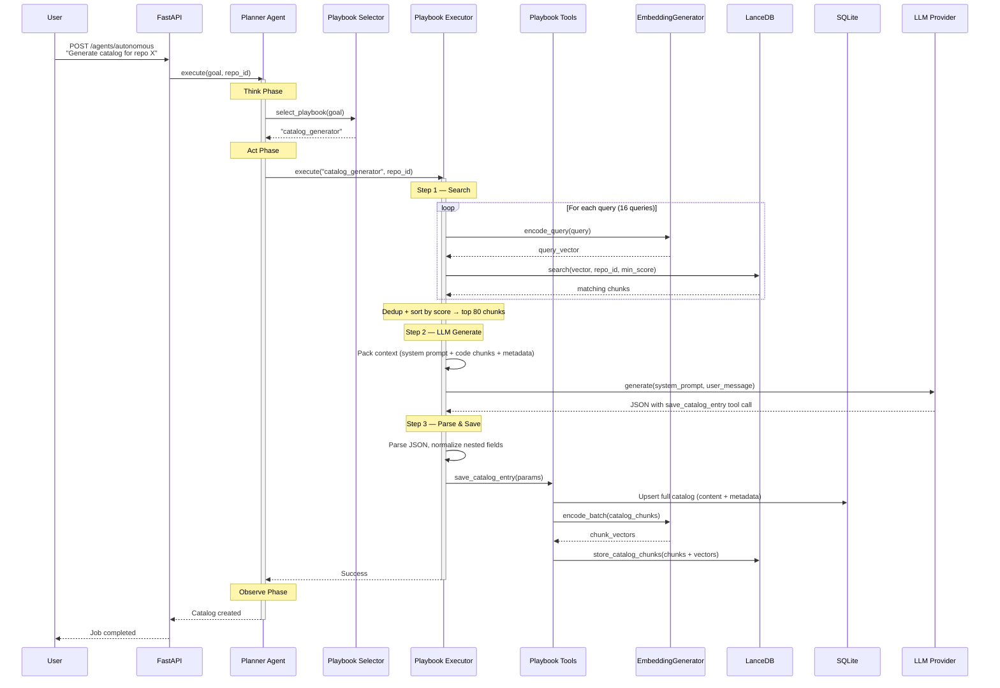
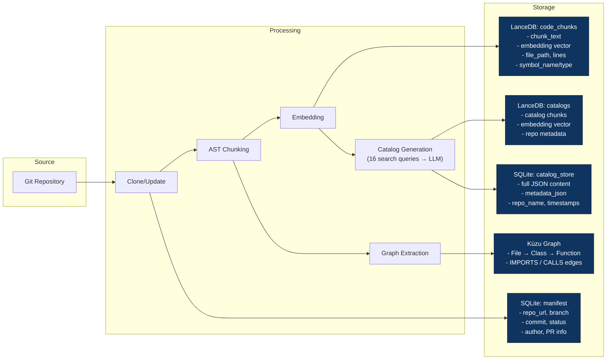
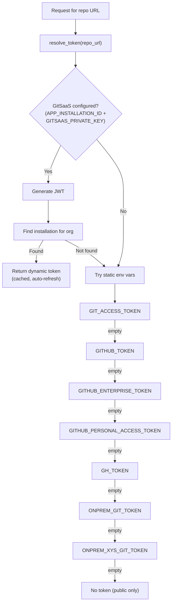

# CodeMind — Discovery Agent Architecture

## System Overview

```mermaid
graph TB
    subgraph UI["Frontend (React)"]
        CAT_UI["Catalog Browser"]
        IDX_UI["Index Manager"]
        SEARCH_UI["Agent Search"]
    end

    subgraph API["FastAPI Server"]
        REST["REST Endpoints"]
        AGENT_API["Autonomous Agent API"]
    end

    subgraph DISCOVERY["🔍 Discovery Agent"]
        direction TB
        PLANNER["Planner Agent<br/>(Think → Act → Observe)"]
        SELECTOR["Playbook Selector"]
        
        subgraph PLAYBOOKS["Playbook System"]
            REGISTRY["Playbook Registry"]
            EXECUTOR["Playbook Executor"]
            
            subgraph PB_DEFS["Playbook Definitions"]
                CAT_GEN["catalog_generator"]
                CODE_EXP["code_explorer"]
                TECH_DEBT["tech_debt_analyzer"]
                SOL_ARCH["solution_architect"]
                CAT_SEARCH["catalog_search"]
            end
        end
        
        subgraph TOOLS["Playbook Tools"]
            SEARCH_CODE["search_codebase"]
            SAVE_CAT["save_catalog_entry"]
            READ_FILE["read_file"]
            SEARCH_SYM["search_symbol"]
            LIST_FILES["list_files"]
        end
    end

    subgraph GIT["Git Operations (git_utils.py)"]
        GIT_REPO["GitRepoManager<br/>(clone / update / cache)"]
        GIT_INT["GitIntegration<br/>(search / branches)"]
        GIT_HUB["GitHubClient<br/>(metadata)"]
        TOKEN["Token Manager<br/>(GitSaaS JWT + static)"]
    end

    subgraph INDEXING["Indexing Pipeline"]
        WORKER["Index Worker"]
        WORKFLOW["IndexingWorkflow<br/>(LangGraph)"]
        DETECT["ChangeDetector"]
        CHUNK["AST Chunker"]
        EMBED_GEN["EmbeddingGenerator"]
        AST["TreeSitter AST"]
        GRAPH_BUILD["Graph Builder"]
    end

    subgraph LLM["LLM Layer"]
        FACTORY["LLM Factory"]
        LOCAL["LocalDriver<br/>(LM Studio)"]
        ENTERPRISE["EnterpriseDriver"]
        APIGEE["ApigeeDriver"]
    end

    subgraph STORAGE["Storage Layer"]
        LANCE["LanceDB<br/>(vectors)"]
        SQLITE["SQLite<br/>(catalog, manifest)"]
        KUZU["Kùzu Graph<br/>(AST relationships)"]
    end

    %% UI → API
    CAT_UI --> REST
    IDX_UI --> REST
    SEARCH_UI --> AGENT_API

    %% API → Discovery Agent
    AGENT_API --> PLANNER
    REST --> EXECUTOR

    %% Discovery Agent internals
    PLANNER --> SELECTOR
    SELECTOR --> REGISTRY
    PLANNER --> EXECUTOR
    EXECUTOR --> REGISTRY
    EXECUTOR --> TOOLS
    EXECUTOR --> FACTORY

    %% Tools → Storage
    SEARCH_CODE --> LANCE
    SEARCH_CODE --> EMBED_GEN
    SAVE_CAT --> LANCE
    SAVE_CAT --> SQLITE
    SEARCH_SYM --> KUZU
    LIST_FILES --> KUZU

    %% Git operations
    REST --> GIT_INT
    GIT_REPO --> TOKEN
    GIT_INT --> TOKEN
    GIT_HUB --> TOKEN

    %% Indexing pipeline
    REST --> WORKER
    WORKER --> WORKFLOW
    WORKFLOW --> DETECT
    WORKFLOW --> CHUNK
    WORKFLOW --> EMBED_GEN
    WORKFLOW --> AST
    WORKFLOW --> GRAPH_BUILD
    GIT_REPO --> WORKFLOW
    CHUNK --> LANCE
    EMBED_GEN --> LANCE
    GRAPH_BUILD --> KUZU

    %% LLM connections
    FACTORY --> LOCAL
    FACTORY --> ENTERPRISE
    FACTORY --> APIGEE

    %% Styling
    classDef discovery fill:#1a1a2e,stroke:#e94560,stroke-width:3px,color:#fff
    classDef storage fill:#0f3460,stroke:#16213e,stroke-width:2px,color:#fff
    classDef git fill:#533483,stroke:#2b1055,stroke-width:2px,color:#fff
    classDef llm fill:#e94560,stroke:#0f3460,stroke-width:2px,color:#fff
    classDef playbook fill:#16213e,stroke:#e94560,stroke-width:1px,color:#fff

    class PLANNER,SELECTOR,EXECUTOR,REGISTRY discovery
    class LANCE,SQLITE,KUZU storage
    class GIT_REPO,GIT_INT,GIT_HUB,TOKEN git
    class LOCAL,ENTERPRISE,APIGEE,FACTORY llm
    class CAT_GEN,CODE_EXP,TECH_DEBT,SOL_ARCH,CAT_SEARCH playbook
```

## Discovery Agent — Catalog Generation Flow

```mermaid
sequenceDiagram
    participant User
    participant API as FastAPI
    participant Planner as Planner Agent
    participant Selector as Playbook Selector
    participant Executor as Playbook Executor
    participant Tools as Playbook Tools
    participant Embedder as EmbeddingGenerator
    participant Lance as LanceDB
    participant SQLite as SQLite
    participant LLM as LLM Provider

    User->>API: POST /agents/autonomous<br/>"Generate catalog for repo X"
    API->>Planner: execute(goal, repo_id)
    activate Planner

    Note over Planner: Think Phase
    Planner->>Selector: select_playbook(goal)
    Selector-->>Planner: "catalog_generator"

    Note over Planner: Act Phase
    Planner->>Executor: execute("catalog_generator", repo_id)
    activate Executor

    Note over Executor: Step 1 — Search
    loop For each query (16 queries)
        Executor->>Embedder: encode_query(query)
        Embedder-->>Executor: query_vector
        Executor->>Lance: search(vector, repo_id, min_score)
        Lance-->>Executor: matching chunks
    end
    Note over Executor: Dedup + sort by score → top 80 chunks

    Note over Executor: Step 2 — LLM Generate
    Executor->>Executor: Pack context (system prompt + code chunks + metadata)
    Executor->>LLM: generate(system_prompt, user_message)
    LLM-->>Executor: JSON with save_catalog_entry tool call

    Note over Executor: Step 3 — Parse & Save
    Executor->>Executor: Parse JSON, normalize nested fields
    Executor->>Tools: save_catalog_entry(params)
    Tools->>SQLite: Upsert full catalog (content + metadata)
    Tools->>Embedder: encode_batch(catalog_chunks)
    Embedder-->>Tools: chunk_vectors
    Tools->>Lance: store_catalog_chunks(chunks + vectors)

    Executor-->>Planner: Success
    deactivate Executor

    Note over Planner: Observe Phase
    Planner-->>API: Catalog created
    deactivate Planner
    API-->>User: Job completed
```

## Data Flow — What Gets Stored Where

```mermaid
graph LR
    subgraph INPUT["Source"]
        REPO["Git Repository"]
    end

    subgraph PROCESS["Processing"]
        CLONE["Clone/Update"] --> CHUNK["AST Chunking"]
        CHUNK --> EMBED["Embedding"]
        CHUNK --> GRAPH["Graph Extraction"]
        EMBED --> CATALOG_GEN["Catalog Generation<br/>(16 search queries → LLM)"]
    end

    subgraph STORE["Storage"]
        LANCE_CODE["LanceDB: code_chunks<br/>- chunk_text<br/>- embedding vector<br/>- file_path, lines<br/>- symbol_name/type"]
        LANCE_CAT["LanceDB: catalogs<br/>- catalog chunks<br/>- embedding vector<br/>- repo metadata"]
        SQL["SQLite: catalog_store<br/>- full JSON content<br/>- metadata_json<br/>- repo_name, timestamps"]
        KG["Kùzu Graph<br/>- File → Class → Function<br/>- IMPORTS / CALLS edges"]
        MANIFEST["SQLite: manifest<br/>- repo_url, branch<br/>- commit, status<br/>- author, PR info"]
    end

    REPO --> CLONE
    EMBED --> LANCE_CODE
    GRAPH --> KG
    CATALOG_GEN --> SQL
    CATALOG_GEN --> LANCE_CAT
    CLONE --> MANIFEST

    classDef store fill:#0f3460,stroke:#16213e,color:#fff
    class LANCE_CODE,LANCE_CAT,SQL,KG,MANIFEST store
```

## Token Resolution Flow

```mermaid
graph TD
    REQ["Request for repo URL"] --> RESOLVE["resolve_token(repo_url)"]
    
    RESOLVE --> GITSAAS{"GitSaaS configured?<br/>(APP_INSTALLATION_ID +<br/>GITSAAS_PRIVATE_KEY)"}
    
    GITSAAS -->|Yes| JWT["Generate JWT"]
    JWT --> INSTALL["Find installation for org"]
    INSTALL -->|Found| DYNAMIC["Return dynamic token<br/>(cached, auto-refresh)"]
    INSTALL -->|Not found| STATIC
    
    GITSAAS -->|No| STATIC["Try static env vars"]
    
    STATIC --> V1["GIT_ACCESS_TOKEN"]
    V1 -->|empty| V2["GITHUB_TOKEN"]
    V2 -->|empty| V3["GITHUB_ENTERPRISE_TOKEN"]
    V3 -->|empty| V4["GITHUB_PERSONAL_ACCESS_TOKEN"]
    V4 -->|empty| V5["GH_TOKEN"]
    V5 -->|empty| V6["ONPREM_GIT_TOKEN"]
    V6 -->|empty| V7["ONPREM_XYS_GIT_TOKEN"]
    V7 -->|empty| NONE["No token (public only)"]
```
