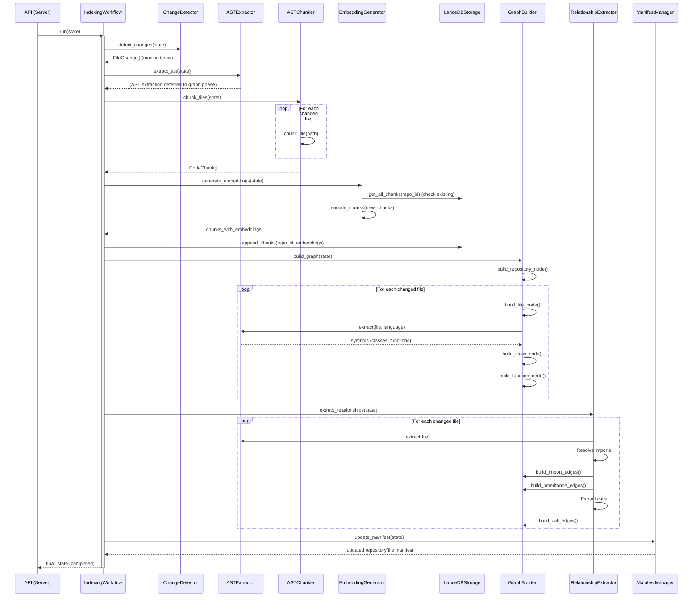
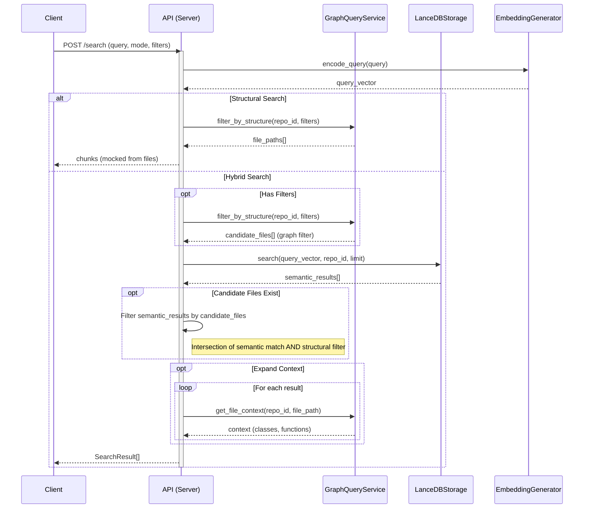
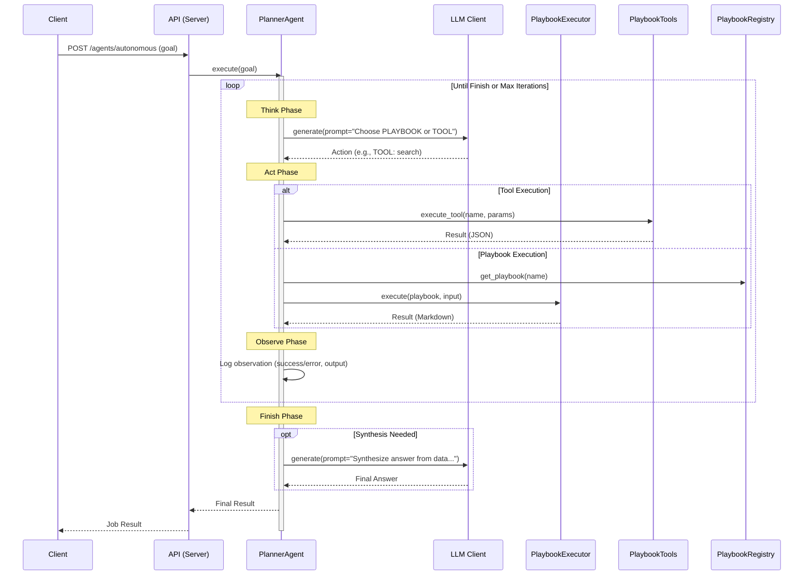
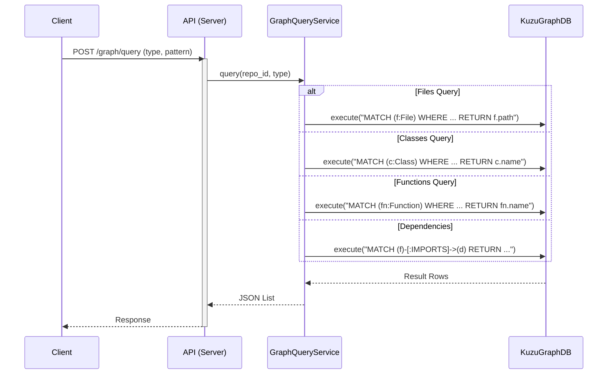
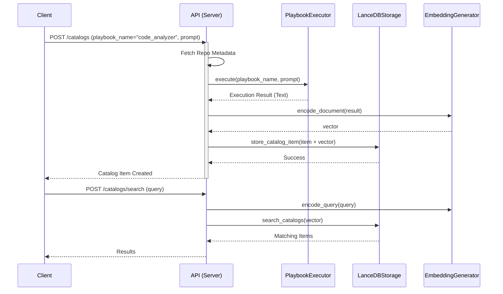

# CodeMind Sequence Diagrams

## 1. Indexing Workflow

The indexing workflow is orchestrated by `IndexingWorkflow`, handling file processing, AST extraction, embedding, and graph building.

## 2. Search Functionality

CodeMind supports Semantic, Structural, and Hybrid search modes.

## 3. Autonomous Agent Flow

The autonomous agent uses a Planner (LLM) to orchestrate Playbooks and Tools in a Think-Act-Observe loop.

## 4. Graph Queries

Direct queries to the Kùzu knowledge graph for structural analysis.

## 5. Catalogs

Creating and retrieving high-level summaries (catalogs) stored in LanceDB.

